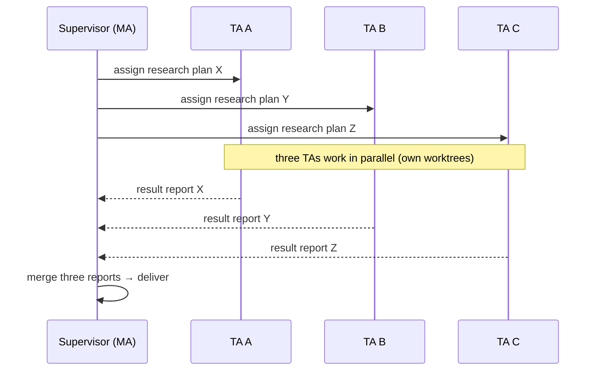

# Pan

> One entry point for all your tasks — talk to a single Meta-Agent (meta-agent, MA for short) and it decomposes and orchestrates a whole team of task-agents (TA) working in parallel.

**English · [中文](./README.md)**

## Design Philosophy: Reduce Cognitive Load

Pan's starting point is not to build a more complex tool, but to relieve a burden — the burden of attention and cognition, whether it belongs to humans or to agents.

This is the most direct lesson from building agent management, clustering, scheduling and communication systems first-hand: cognitive load drops on both sides.

**For humans**: parallel work used to mean juggling 7–8 terminals with attention torn apart — an extremely painful experience. Now you talk to a single MA and enjoy a clean context.

**For agents**: everyone sticks to its own role — the MA (Meta-Agent) is never drowned in detailed context, while task-agents (TA) receive ultra-high-quality prompts written by an agent with a global view. And the MA's ability to decompose tasks and orchestrate parallel/serial steps, dependencies and boundaries is astonishing.

The combined result: at least a 10× boost in efficiency.

---

Spend 30 seconds to see Pan's selling points and typical workflows first; the full feature / configuration / API reference is in the [Table of Contents](#table-of-contents) below.

**Pan is not an all-or-nothing product — it is a spectrum of an extensible middleware layer**: used shallowly, it is a minimal "Session & Agent CLI manager"; used to its full depth, it is a complete, extensible "Agent cluster management & collaboration system + MCP tool layer" — and every depth in between can be enabled on demand (see "[Pan is a spectrum](#-pan-is-a-spectrum-scale-it-as-you-go)").

---

## 💡 Why choose Pan (differentiation in 30 seconds)

Monolithic AI coding assistants are "one-to-one": you say one thing, it does one thing, then you stare at each other. **Pan lets you talk to a single MA (Meta-Agent) and command an entire team of AI helpers at the same time.**

| Problem you want to solve | Pan's answer |
|---------------------------|--------------|
| **Parallel tasks**: driving several modules / projects at once by juggling multiple terminal windows | 👔 **MA auto-decomposes and dispatches**: whether and how to split is decided by the orchestration methodology; multiple TAs work in parallel, each in its own git worktree |
| **Losing context when switching CLIs**: moving from assistant A to B loses all history — you start over from scratch | 🔁 **Session handoff (session_handoff)**: switch whenever you want; the new CLI takes over the whole relationship graph with a compact summary — the same task continues seamlessly across CLIs and saves context |
| **Locked into one vendor**: model / assistant bound to one CLI ecosystem | 🔌 **Protocol-based multi-CLI adapters**: cbc / kimi / opencode / claude / codex supported; the cluster is unaware of the underlying CLI — write model rules to route tasks by type to the right adapter |
| **AI has no memory**: re-explaining background and preferences every time | 🧠 **Memory + Character**: hybrid vector + full-text retrieval auto-injects relevant memory; persona stays the same identity across Sessions |
| **AI hangs halfway**: process dies, runaway task with nobody watching | 🐕 **Watchdog self-healing**: hangs / quiet timeouts are cleaned up automatically; on abnormal process death the on-disk queue rebuilds the Worker and keeps going |
| **Not at the computer**: want to command via QQ or check in remotely | 🚪 **Multi-channel command**: Web Dashboard / QQ / Cloudflare public tunnel / MCP — the same control plane from anywhere |

## 🧭 What is it? (Three sentences)

- 👔 **One supervisor (Meta-Agent, meta-agent, MA for short)**: does no work itself; it hires, dispatches, listens, and accepts — like a project manager. MA is a role: it exists as a Session (the persistent orchestration identity) and runs inside its own Worker process.
- 🧑‍💻 **A team of helpers (task-agent, TA)**: each TA also lives as a Session (a persistent AI conversation) with its own memory, persona, and tools, working in its own workdir without interfering with others; a Worker is the temporary CLI process that actually runs an MA or TA session (processes are incidental and can be rebuilt anytime).
- 🧍 **You stand in the middle**: like a factory director at the big control-room screen — you can see what every helper is doing, and interrupt, redirect, or take over any Worker's terminal yourself.

Pan is that **control plane**: it manages processes, sessions, memory, and reporting, turning "many AIs working together" from "manually bouncing between terminal windows" into "a well-oiled pipeline".

## 🌐 Pan is a spectrum: scale it as you go

The orchestration, inbox, and session handoff you saw above are Pan's "deep end". But Pan **never demands you dive all the way in** — it is a continuously scalable middleware layer, and you can stop at any depth of the spectrum:

| Depth | You can treat Pan as… | What this layer includes | Who it's for |
|-------|----------------------|--------------------------|--------------|
| 🟢 **Minimal** | **Session & Agent CLI manager** | Multi-session management (create / rename / branch / delete), multi-CLI adapters (cbc / kimi / opencode / claude / codex), historical session import, process start/stop and terminal takeover, Web Dashboard | Individual developers / small teams: just want one place to manage their AI CLI sessions |
| 🟡 **Typical collaboration** | **Multi-agent collaboration control plane** | Everything above + MA orchestration (assign / claim / report-subscribe), on-disk inbox, branch clones, Memory + Character (memory & persona), Watchdog self-healing | Heavy AI users: let AI share the load of multiple parallel tasks, with a team that "has memory and doesn't break" |
| 🔴 **Full cluster** | **Agent cluster management & collaboration system + MCP tool layer** | Everything above + the SMA orchestration template and full methodology, a parallel Worker team (each in its own git worktree), session handoff (switch CLIs without losing context), multi-channel command (Web / QQ / Remote / MCP), any external Agent taking over orchestration via MCP | Advanced users / heavy automation: the AI team owns the whole workflow, and you only confirm decomposition and accept results |

The two endpoints, in one sentence each:

- **Shallow use**: open one Session with one CLI and Pan is a handy "Session & Agent CLI manager" — you never need to understand MA, inboxes, or orchestration; they just wait for you in the background;
- **Deep use**: create an SMA template session in one click — the MA decomposes and dispatches, a team of TAs works in parallel, and reports are auto-delivered to an on-disk inbox — Pan becomes a full "Agent cluster management & collaboration system + MCP tool layer" that any MCP-capable external Agent can walk into as the supervisor.

The key: **every tier builds on the one before it — depth is additive, not a different system.** If you use it as a session manager today and want orchestration tomorrow, you migrate nothing — you simply start using more tools. Every feature described below belongs to some layer of this spectrum: read as deep as you use.

## 📖 Every concept in one table

| Plain words | Technical concept | Description |
|-------------|-------------------|-------------|
| 👔 Project manager | **meta-agent (MA) / SMA** | No hands-on work; only dispatch: hire, assign, listen, accept. A role, not a process: exists as a Session and runs inside its own Worker (SMA is Pan's built-in MA template) |
| 🧑‍💻 Task-doing employee | **task-agent (TA)** | The agent that carries out concrete dev / test / research / doc tasks, dispatched by the MA via `agent_assign`; likewise exists as a Session and runs in a Worker |
| 🧑‍💻 Full-time employee | **stream Worker** | A long-running CLI process mode, available anytime for multi-turn conversations, can mount MCP tools (a Worker is a process, not an identity; both MA and TA run in Workers) |
| 🧳 Freelancer for one job | **one-shot Worker** | One task spawns one process with a full toolbox, done and gone |
| 🔌 Different tool brands | **CLI Adapter** | One protocol-based adapter per CLI Agent (cbc / kimi / opencode / claude / codex); switching doesn't touch business logic |
| 🔁 A stand-in takes over your work | **session_handoff** | Creates a twin Session that takes over: relationship graph / report subscriptions / QQ bindings all transfer, with a compact summary |
| 📤 "Take this, report when done" | **assign** | Asynchronous dispatch: fire and go do something else; a report arrives when done |
| 📬 "Auto-assign work to you from now on" | **report-subscribe** | Subscription reporting: a finished TA auto-delivers its report to the MA's inbox (persisted, never lost) |
| 🔗 "You report to me now" | **claim** | Establishes a bidirectional supervisor ↔ Session (TA) binding |
| 🌿 Fork a clone to try another path | **branch** | Forks an independent branch from an existing Session, inheriting model / memory / tools |
| 🎛️ Boss grabs the keyboard | **takeover** | Takes an AI session back into a human terminal (restart + held) |
| 🧠 Employee's long-term memory | **Memory** | Hybrid vector + full-text (FTS5) retrieval, auto-injected before work starts |
| 🎭 An employee with personality | **Character** | Persona + dedicated memory store, keeping the same identity across Sessions |
| 🐕 A supervisor who never sleeps | **Watchdog** | One per Worker: cleans up hangs / timeouts; the global level can also restock Workers |
| 🖥️ Workshop monitoring screen | **Dashboard** | Watch every Worker's output live in the browser (React is the only frontend) |
| 💬 Command via QQ | **QQ Bridge** | Turns QQ messages into Worker commands; NapCat / LLOneBot channels are switchable |
| 🌐 Remote office | **Remote** | Cloudflare Tunnel exposing the control plane to the public internet |

## 👔 Meta-Agent orchestration: one boss for a whole AI team

The Meta-Agent is not a special program but a **role** (meta-agent, MA) — any party (your Agent CLI, a script, or even another Pan session) can play the "supervisor" as long as it meets three conditions (can send commands, can receive intel, has an identity).

In Pan, "parallel tasks" doesn't mean opening several terminal windows and stitching results together manually — it means one instruction decomposed into a parallel team of TAs. This is a real, runnable workflow:

```
You: develop modules 1/2/3 of project A in parallel, investigate a bug in project B, remind me about a meeting at 3pm.

SMA (three decision questions → decompose → dispatch):
├─ ta-a1 · project A · module 1 dev   (worktree-1)
├─ ta-a2 · project A · module 2 dev   (worktree-2)
├─ ta-a3 · project A · module 3 dev   (worktree-3)
├─ ta-b1 · project B · bug investigation
└─ ta-l1 · life · 3pm meeting reminder

You (a moment later): report progress.
→ SMA collects all results, trust-but-verify acceptance item by item, merges into one report.
```

Even better: the orchestration layer is **unaware** of the underlying CLI. "Which task goes to which CLI" is written into the SMA's model rules — e.g. "heavy work to cbc, lightweight research to kimi, writing to opencode" — with no changes to the cluster itself.

> The full orchestration methodology (three decision questions / parallel dispatch / subscription-based reporting / trust-but-verify acceptance / consolidated delivery) and the built-in SMA template are in "[Meta-Agent Orchestration](#meta-agent-orchestration)" below.

## 🔌 Multi-CLI adapters: use whichever you like

Pan's Workers are not locked into any single CLI ecosystem — every CLI Agent has an adapter implementing the `CliAdapter` protocol, and the contract between a Worker and its adapter is uniform:

- **Switch whenever you like**: hand different tasks to different CLIs (cbc / kimi / opencode / claude / codex); switching doesn't touch business logic, and session handoff keeps the context with you;
- **Route by task type**: write SMA model rules to send "heavy work to cbc, lightweight research to kimi, writing to opencode" — zero cluster changes;
- **Low cost to add a new CLI**: implement one `CliAdapter` protocol class (methods grouped into metadata / process spawn / message encoding / event parsing / takeover) + one registration line.

Execution modes and integration details for each adapter are in "[Multi-CLI Adapters](#multi-cli-adapters)" below.

## 🔁 Session handoff: switch CLIs, keep the context

A normal Session **cannot switch adapters mid-way** — but in practice you'll want to: you're tired of this assistant, or that assistant is better at the task at hand. Pan's answer is **session_handoff**: create a twin Session to take over. One handoff does three things:

- **The whole relationship graph transfers**: the new session takes over the managed relationship graph, `report_subscriptions`, and QQ postbox bindings — your AI team keeps reporting to the new session with nothing rebuilt;
- **The old session stays readable**: the old session is auto-renamed to `(archive) <name>` and becomes a managed session of the new one — old context is always available;
- **Only a compact summary travels**: handoff doesn't copy the full history, only a handoff brief — **avoiding long-session context bloat; the new session starts light**.

> **Typical scenario**: session A is at hundreds of thousands of tokens and about to blow up → have A write a handoff brief → `session_handoff` creates a compact twin session B and the same task continues seamlessly; or simply switch CLIs, with the context summary following.

## 🎯 One entry point for all your tasks

You might be juggling several parallel subtasks of one project, progress on several projects, or even life chores (schedules, reminders, automation). To the MA, these are all just **TA sessions (and their Worker processes) that can be dispatched concurrently** — you don't have to watch each terminal separately:

To you, it's one conversation from start to finish; to them, it's a team collaborating in parallel. And you always keep the final say — watch, interrupt, take over, whatever you like.

## 📬 Managed subscriptions: an "AI inbox" per supervisor

How do you collect results from dispatched tasks? Pan's answer is **subscription-based reporting + an on-disk queue** — turning "chasing each worker" into "auto-delivery":

- **Subscribe means take over**: subscribing to a Session's reports also establishes the managed relation (claim) in one step — no two-step setup;
- **Auto-delivery**: every time a managed TA finishes (or errors), the report is auto-dropped into the MA's dedicated inbox (`queue_pending`) — no need to ask one by one;
- **Persisted, never lost**: the inbox lives on disk — if the MA disconnects mid-way, reports are still there after reconnecting;
- **Clear ownership**: each Session belongs to one supervisor (`managed_by`) — whoever manages receives, a star topology at a glance, and nobody else can subscribe by privilege escalation.

So for a supervisor, managing a bunch of tasks = managing one inbox: **dispatch → check the inbox → accept → merge and report**.

## 🤝 Multi-agent collaboration: three typical workflows

**① Parallel fan-out (one supervisor, many workers, all at once)**



**② Serial pipeline (one stage's output is the next stage's input)**

```
assign(W1: write tech spec) → subscribe report → get spec → assign(W2: write code) → get code → assign(W3: code review)
```

Each step waits for the previous stage's completion report — as controllable as a factory pipeline.

**③ Long-term collaboration (a veteran team with memory)**

Once Workers are given a Character (persona + memory store) and a Memory directory, Pan auto-injects relevant memory into the context at the start of every task — your AI team **remembers project context and your preferences** instead of starting from zero each time.

## 🚪 Command from anywhere: the multi-channel matrix

One control plane, four entrances, switch anytime:

| Channel | Entry | Description |
|---------|-------|-------------|
| 🖥️ **Web Dashboard** | `http://127.0.0.1:{port}` | React SPA (the only frontend); `/` redirects to `/react/`, and a missing React build returns 503 |
| 💬 **QQ Bridge** | NapCat / LLOneBot | **Pluggable** OneBot 11 gateways: both channels are thin subclasses of `QQChannel`; zero business-code changes; `mirror` full mirror / `selective` dual modes |
| 🌐 **Remote** | Cloudflare Tunnel | Expose to the public internet in one click — manage it from outside |
| 🔌 **MCP / WS** | `packages/mcp` + `/ws/agent` | Let any Agent CLI act as the supervisor: MCP tools + event-stream subscription, the MA access channel |

> Startup / configuration / switching details for each channel are in "[Channels & Integrations](#channels--integrations)" below.

## ✨ Why it's worth a try

- 🌐 **A scalable spectrum**: shallow use is a "Session & Agent CLI manager"; deep use is an "Agent cluster management & collaboration system + MCP tool layer" — every depth is additive and on demand, never all-or-nothing.
- 🛡️ **A self-healing control plane**: Worker hung? The Watchdog cleans up (quiet timeout / task-runtime timeout / idle reclamation); process died abnormally? The on-disk queue rebuilds the Worker and keeps going.
- 📬 **Managed subscription inbox**: every supervisor has an on-disk inbox; managed Workers auto-deliver reports when done — dispatch and walk away, just check the inbox later.
- 🔁 **Switch CLIs without losing context**: session handoff makes "switching to the Agent you like" a routine operation — the same task flows seamlessly between CLIs and saves context.
- 🔌 **Not locked into any CLI ecosystem**: protocol-based adapters + cluster unawareness; adding a CLI is one registration line, and the MA routes by model rules.
- 🖐️ **Human and AI are equals**: you can interrupt, take over the terminal, fork a clone, or jump in yourself on any Worker.
- 🧠 **Has memory and personality**: hybrid vector + full-text retrieval auto-injects; Character persona persists across Sessions.
- 🚪 **Command across channels**: Dashboard, QQ, public tunnel, MCP — the same control plane from anywhere.
- 🧩 **Can act as a "tool base"**: external domain projects can plug their service into Pan and have Pan's QQ Bot and Workers do the work (first case: RuleWhisper; `command_routes` in `manifest.json` lets QQ prefix commands forward directly to an external HTTP API, bypassing the LLM).

---

## Table of Contents

- [💡 Why choose Pan (differentiation in 30 seconds)](#-why-choose-pan-differentiation-in-30-seconds)
- [🧭 What is it? (Three sentences)](#-what-is-it-three-sentences)
- [🌐 Pan is a spectrum: scale it as you go](#-pan-is-a-spectrum-scale-it-as-you-go)
- [📖 Every concept in one table](#-every-concept-in-one-table)
- [👔 Meta-Agent orchestration: one boss for a whole AI team](#-meta-agent-orchestration-one-boss-for-a-whole-ai-team)
- [🔌 Multi-CLI adapters: use whichever you like](#-multi-cli-adapters-use-whichever-you-like)
- [🔁 Session handoff: switch CLIs, keep the context](#-session-handoff-switch-clis-keep-the-context)
- [🎯 One entry point for all your tasks](#-one-entry-point-for-all-your-tasks)
- [📬 Managed subscriptions: an "AI inbox" per supervisor](#-managed-subscriptions-an-ai-inbox-per-supervisor)
- [🤝 Multi-agent collaboration: three typical workflows](#-multi-agent-collaboration-three-typical-workflows)
- [🚪 Command from anywhere: the multi-channel matrix](#-command-from-anywhere-the-multi-channel-matrix)
- [✨ Why it's worth a try](#-why-its-worth-a-try)
- [Introduction](#introduction)
- [Features](#features)
- [Core Concepts](#core-concepts)
- [Quick Start](#quick-start)
- [Architecture](#architecture)
- [Multi-CLI Adapters](#multi-cli-adapters)
- [Meta-Agent Orchestration](#meta-agent-orchestration)
- [Configuration](#configuration)
- [API Overview](#api-overview)
- [Channels & Integrations](#channels--integrations)
- [Operational Notes](#operational-notes)
- [Documentation](#documentation)
- [Contributing](#contributing)
- [License](#license)

---

## Introduction

Pan is a **CLI Agent orchestration platform**. Built on a Supervisor/Worker architecture, one "MA" supervisor (meta-agent) directs multiple TA sessions (each running independently, carried by a temporary Worker process) through MCP tools and WebSocket event streams. Each TA works in its own git worktree, and you can command the platform from a web dashboard, QQ, a public tunnel, or any Agent CLI — and you can always watch, interrupt, or take over any Worker's terminal.

- **Tech stack**: Python + FastAPI + WebSocket + SQLite (FTS5 full-text search) + optional embedding-based vector search; frontend: React (the only frontend).

Traditional one-to-one AI coding assistants work as "you say one thing, it does one thing." Pan upgrades this to **one-to-many**: you talk to a single supervisor, who orchestrates multiple Workers in parallel and consolidates the results into one deliverable for you.

Typical use cases:

- **Parallel tasks** — drive multiple subtasks of the same project, multiple projects, or even life chores (schedules, reminders, automation) at the same time;
- **Multiple CLIs** — hand different tasks to different CLI Agents and switch between them without losing context;
- **AI with memory** — hybrid vector + full-text retrieval injects relevant memory at startup, and a persona persists across Sessions;
- **Command from anywhere** — Dashboard / QQ / public tunnel / MCP are all entrances to the same control plane.

## Features

- **MA orchestration (SMA template)** — one supervisor runs the full loop: decompose → parallel dispatch → subscribed reporting → trust-but-verify acceptance → consolidated delivery.
- **Protocol-based multi-CLI adapters** — `CliAdapter` protocol + registry with **cbc / kimi / opencode / claude / codex** built in; the orchestration layer is unaware of the underlying CLI.
- **Session handoff (session_handoff)** — when switching CLIs, a twin session takes over, carrying the relationship graph / subscriptions / reports while keeping only a compact summary to avoid context bloat.
- **Managed subscription inbox** — subscription-based reports are delivered to an on-disk inbox; the supervisor "dispatches work, then checks the inbox." Reports survive disconnects and reconnects.
- **Self-healing Worker lifecycle** — `stream` / `one-shot` execution modes; a three-tier Watchdog timeout cleanup plus an on-disk queue that rebuilds Workers after an abnormal process exit.
- **Memory + Character** — SQLite FTS5 + embedding hybrid retrieval; a Character (persona) and its memory store persist across Sessions as the same identity.
- **Per-session MCP** — each Session can mount its own MCP Server; two servers ship built in: `pan` (38 orchestration tools) and `pan-qq` (6 QQ tools).
- **Multi-channel access** — Web Dashboard (React is the only frontend), QQ Bridge (pluggable NapCat / LLOneBot channels), Cloudflare Tunnel, and any Agent CLI (WS + MCP).
- **Session import** — historical sessions from cbc / kimi / opencode / claude / codex can be imported and reused, avoiding re-exploration and re-initialization.

## Core Concepts

> **Three layers**: **role (MA/TA) — identity (Session) — process (Worker)**. MA/TA are responsibility roles; a Session is the persistent orchestration identity carrying an MA or TA; a Worker is the temporary CLI process that actually runs an MA or TA session — there are both MA Workers and TA Workers; never equate a Worker with a TA.

| Concept | Description |
|---------|-------------|
| **MA (meta-agent)** | The orchestration role: does no work itself, only decomposes, dispatches, listens, and accepts; exists as a Session (the built-in SMA template is an MA) and runs inside its own Worker |
| **TA (task-agent)** | The execution role: carries out concrete dev / test / research / doc tasks; likewise exists as a Session and runs in a Worker |
| **Session** | The persistent orchestration object (identity layer, formerly "Agent"): persistent identity (`ses_<16hex>`) owning the `queue_pending` inbox, agentLevel, and the managedBy chain; delivery/orchestration semantics bind to it. Independent of the Worker lifecycle |
| **Worker** | The physical executor (process layer): a temporary CLI process instance that actually runs an MA or TA session; two forms: `stream` (long-running) and `one-shot` (single task) |
| **CLI Adapter** | One protocol-based adapter per CLI Agent (cbc / kimi / opencode / claude / codex) |
| **session_handoff** | Creates a twin Session to take over an old one; relationship graph / subscriptions / reports follow |
| **assign** | Asynchronously dispatches a task (taskId idempotent); you receive a report when it completes |
| **report-subscribe** | Subscription-based reporting: a finished TA auto-delivers its report to the MA's on-disk inbox |
| **claim** | Establishes a bidirectional supervisor ↔ Session (TA) management binding |
| **branch** | Forks an independent branch from an existing Session, inheriting model / memory / tools |
| **takeover** | Takes an AI Session back into a human terminal |
| **Watchdog** | One per Worker: cleans up hangs / timeouts; a global-level Watchdog restocks Workers |
| **Memory** | Hybrid vector + full-text (FTS5) retrieval, auto-injected before work starts |
| **Character** | Persona + dedicated memory store, keeping the same identity across Sessions |
| **QQ Bridge** | Bridges QQ messages ↔ Worker commands; NapCat / LLOneBot channels are switchable |
| **Remote** | Cloudflare Tunnel exposing the control plane to the public internet |

## Quick Start

> For the full guide (installation / operations / orchestration / API / configuration / troubleshooting), see the [User Manual](docs/USER_MANUAL.en.md).

Follow this order for a first user setup: prepare the environment → install dependencies → generate configuration → start Pan → open the React Dashboard → create a session and send the first task.

### Prerequisites

- Python 3.14 (current development environment: 3.14.5)
- Node.js + pnpm (to build the React frontend)
- At least one supported Agent CLI installed and discoverable in the current environment: `cbc` (CodeBuddy CLI), `kimi`, `opencode`, `claude`, or `codex`

Pan does not install third-party Agent CLIs. In the **same terminal / user environment that will start Pan**, verify that at least one CLI is installed globally:

```bash
cbc --version
kimi --version
opencode --version
claude --version
codex --version
```

At least one command should print a version. At startup, Pan logs a `ready/unavailable` status for every CLI. A missing optional CLI does not prevent Pan from starting, but creating a Worker with that adapter shows installation, PATH, and restart guidance. If all CLIs are missing, Workers cannot run. A background service may have a different PATH from your interactive terminal, so restart Pan after installing a CLI or changing PATH. Inspect `GET http://127.0.0.1:8768/api/cli/status` for live diagnostics.

> **Frontend note**: the React Dashboard is the only frontend. Visit the root URL or `/react/`.

### Install & Start

```bash
# 1. Install the minimal dependencies (core only, no Memory ML chain)
pip install -r minimal-requirements.txt

# 2. Generate configuration (every field is optional; omitted fields use defaults)
cp config.example.json config.json        # Windows: copy config.example.json config.json

# 3. Build the React frontend (recommended; output → packages/web/dist/)
cd packages/web
pnpm install   # first time
pnpm build
cd ../..

# 4. Start
python main.py
# → http://127.0.0.1:8768
#   main branch defaults to 8768; test branch to 8767; override with PAN_PORT

```

**Pick the startup method by platform**:

| Platform | Install dependencies | Start | Stop |
|----------|----------------------|-------|------|
| Windows | Steps 1-3 above (or `scripts\setup.bat`) | `scripts\start_pan.bat`, or foreground `python main.py` | `scripts\stop_pan.bat`, or Ctrl+C |
| macOS / Linux | `bash scripts/setup.sh` (first time) | `bash scripts/start.sh` (background; PID in `data/process.pid`, log `data/pan.out.log`) | `bash scripts/stop.sh` (kills only the recorded PID + process group, never other python processes) |

macOS / Linux one-liner path:

```bash
bash scripts/setup.sh   # first time: deps + config.json + frontend build
bash scripts/start.sh   # start → http://127.0.0.1:8768
bash scripts/stop.sh    # stop
```

### Ports and Environment Variables

| Port | Purpose |
|------|---------|
| 8768 | Pan main service (`main` default; `test` uses 8767; controlled by `config.json` → `port`) |
| 8769 | Remote status service (`remote.status_port`) |
| 8080 | QQ plugin (NoneBot) HTTP API, not exposed |
| 3001 / 3002 | NapCat / LLOneBot forward-WS gateways |
| 9740 | Default MCP server SSE/streamable-http port |

| Environment variable | Default | Description |
|----------------------|---------|-------------|
| `PAN_PORT` | — | Overrides `port` |
| `PAN_HOST` | `127.0.0.1` | Listen address; non-loopback prints an unauthenticated warning |
| `PAN_API_URL` | `http://127.0.0.1:8768` | Address the MCP server uses to reach Pan Core |
| `PAN_URL` | `http://127.0.0.1:{port}` | Address QQ Bridge uses to reach Pan Core |
| `PAN_QQ_API_URL` | `http://127.0.0.1:8080` | Address pan-qq MCP uses to reach the QQ plugin |
| `PAN_QQ_PYTHON` | platform default | QQ bot interpreter path |
| `PAN_QQ_MODE` | — | Overrides `qq.mode` |
| `ONEBOT_WS_URLS` / `ONEBOT_ACCESS_TOKEN` | — | QQ channel WS address / token; can be written in `packages/qq/.env` |

The `main` branch uses <http://127.0.0.1:8768> by default and `test` uses 8767. Set `port` in `config.json` or override it with `PAN_PORT`; after changing it, use the same port in the browser URL and `PAN_API_URL`.

### First Use: Complete a Task from the Dashboard

After starting Pan, open <http://127.0.0.1:8768> in a browser. The React Dashboard has the session list on the left and the chat area on the right.

1. Click **New** in the left sidebar, or click the ⚙ gear to open the new-session config dialog. Set the adapter (`cbc` / `kimi` / `opencode` etc.), session name, workdir, and optional session template. The default workdir is `data/workdirs/<session name>`.
2. The new session card shows its status dot, adapter, model, and message count. Model, permission mode, and thinking level can be changed later in session settings.
3. Select the session and click **Start** in the top bar. Enter a task and press **Enter**; use Shift+Enter for a newline. Messages sent while the Worker is busy enter the send queue and are processed in order.
4. Status colors mean green = idle, blue = running, yellow = taken over by a human, and red = error. Replies stream into chat; tool calls can be opened in the right-side DetailPanel.
5. Continue with follow-up messages, use **Editor** to browse/edit files in the session workdir, or right-click the session → Delete when finished. See [Chapter 5 of the User Manual](docs/USER_MANUAL.en.md#5-dashboard-guide) for the complete UI guide.

#### Ask SMA Directly: Create a Parameterized Session

In the Web Dashboard, click “create a parameterized session” to start a configurable session:


In the template list, choose `SMA(NoAdapter)`. Be sure to choose the `NoAdapter` version so you can configure the adapter yourself afterward:

.png>)

Once created, ask SMA "how does Pan work?" It can call `pan_handbook` to explain Pan's orchestration capabilities with a live walkthrough.

### First SMA Workflow and Boundaries

The recommended pattern is to talk to one `SMA(NoAdapter)` supervisor session and give it the goal, boundaries, and acceptance criteria. It decides whether to split the work; when parallel work is worthwhile, it creates and manages child sessions, dispatches tasks, subscribes to reports, and performs trust-but-verify acceptance before delivering a consolidated result:

1. Create a session with the **SMA(NoAdapter)** template.
2. Give it a goal such as “research plans A / B / C in parallel, give a conclusion for each, then produce a comparison report.”
3. SMA uses `session_create`, `agent_assign`, and `report_subscribe`; completed reports arrive in its `queue_pending` inbox.
4. SMA verifies and delivers the result, then can use `session_batch_delete` to clean up child sessions.

Use a regular session for a simple question or one-line change. Use SMA for parallel work, consolidated delivery, or long-running collaboration. Deleting a session does not delete its disk workdir, so save any required artifacts first. See [Chapter 4 of the User Manual](docs/USER_MANUAL.en.md#4-two-ways-to-create-a-meta-agent) for the full guidance.

### Configuration Essentials

The repo-root `config.json` is gitignored and generated from `config.example.json`; every field is optional. After editing it, normally restart `python main.py`; adapter, worker, plugin, and memory settings can also be hot-reloaded from global UI settings.

```json
{
  "port": 8768,
  "cbc": { "model": "deepseek-v4-flash", "models": [], "permission_mode": "bypassPermissions" },
  "worker": { "timeout_sec": 300, "task_timeout_sec": 1800, "idle_sec": 300 }
}
```

- `models: []` auto-detects models available to the CLI; filling it restricts the UI choices.
- `bypassPermissions` skips per-step approval for commands and file edits and is intended only for trusted environments; `default` / `acceptEdits` are more conservative. Pan has no authentication by default and binds to `127.0.0.1`.
- `worker.timeout_sec` is the no-output silence timeout, `task_timeout_sec` caps total stream-task duration, and `idle_sec` reclaims an idle process after completion.

For QQ, start NapCat (3001) or LLOneBot (3002) first and set `qq.channel`; `qq.mode` is `mirror` for automatic replies or `selective` to send messages only to the orchestrator inbox. Set `qq.enabled=false` if QQ is not needed. See [Chapters 4 and 12 of the User Manual](docs/USER_MANUAL.en.md#12-mcp-and-troubleshooting) for MCP injection, external Agent access, and the full field reference.

### Stopping and Common Limits

Use Ctrl+C for a graceful exit, or `scripts/stop_pan.bat` / `scripts/stop.sh`. macOS/Linux paths are case-sensitive; a background service may have a different PATH, so restart Pan after changing a CLI or PATH. The API has no authentication by default, and Remote/Cloudflare Tunnel exposes the main port publicly; assess the risk before enabling it. A Worker reclaimed by the watchdog can be started again while Session history remains; deleting a Session does not delete its workdir. See [Chapters 12 and 13 of the User Manual](docs/USER_MANUAL.en.md#13-security-and-cleanup) for troubleshooting and security notes.

### Frontend: React only

**The React frontend is the only frontend**: after step 3 above, just visit `http://127.0.0.1:{port}` (307-redirects to `/react/`).

For development, use Vite HMR:

```bash
cd packages/web
pnpm dev       # dev mode: Vite HMR + proxy to backend
```

Routing is no longer controlled by a frontend setting: `/` always redirects to `/react/`. If `packages/web/dist/` is missing, `/` and `/react/` return an actionable 503; run `cd packages/web && pnpm build` to restore the dashboard.

## Architecture

```
         Meta-Agent (MA)              Human                     Remote access
    (Agent CLI / MCP)           (Dashboard)            (Cloudflare Tunnel)
          │                          │                          │
   /ws/agent + MCP tools       /ws + HTTP                Public URL + WS
    (event stream + commands) (observe + inject + takeover) (Dashboard / QQ Bot external access)
          │                          │                          │
          └──────────┬───────────────┘                          │
                     │                                          │
            ┌────────▼────────┐                                 │
            │  Pan Core         │◄──────────────────────────────┘
            │  (FastAPI service) │        HTTP / WebSocket
            │                   │
            │  Session Manager │
            │  ├─ Worker-1     │── CliAdapter protocol (cbc / kimi / opencode / claude / codex)
            │  ├─ Worker-2     │── ... (unaware of each other, routed by adapter name)
            │  └─ Worker-N     │
            │                   │
            │  Character framework │── profile → character → memory
            │  Memory subsystem    │── SQLite + FTS5 + embedding retrieval
            │  Event Bus           │─── WS broadcast
            │  Session Store       │─── JSON persistence
            └──────────────────┘
```

### Module Layout

| Directory | Responsibility |
|-----------|----------------|
| `packages/core/` | Core module: process management + message routing + Memory + Adapters. All external modules talk to Core only over HTTP/WS APIs |
| `packages/web/` | Web channel: FastAPI routes + WebSocket + Dashboard (~99 HTTP routes, counted 2026-09-03) |
| `packages/qq/` | QQ channel: NoneBot2 bridge + pluggable channels + pan-qq MCP |
| `packages/mcp/` | MCP Server: orchestration toolset + pan-qq, can be started standalone |
| `packages/remote/` | Cloudflare Tunnel remote channel |
| `scripts/` | Start / stop / tunnel / pre-commit scripts |
| `docs/` | Documentation (git-tracked; `docs/skills/pan/SKILL.md` is the single source of truth for orchestration knowledge) |
| `tests/` | Tests (63 Python test files + conftest; `python -m pytest tests/ -q` collects 806, counted 2026-09-03) |

## Multi-CLI Adapters

Workers are decoupled from any specific CLI: each CLI Agent has an adapter implementing the `CliAdapter` protocol (`packages/core/adapters/base.py`; methods grouped into metadata / process spawn / message encoding / event parsing / takeover), registered by name in the registry (`packages/core/adapters/registry.py`) at startup.

| Adapter | CLI | Execution mode | Description |
|---------|-----|----------------|-------------|
| `cbc` | CodeBuddy CLI | stream + one-shot | Native JSON stream protocol; the primary adapter |
| `kimi` | Kimi CLI | stream (long-running wrapper) | Calls `kimi -p` per message inside a wrapper |
| `opencode` | OpenCode CLI | stream (long-running wrapper) | Calls `opencode run --format json` per message inside a wrapper |
| `claude` | Claude Code CLI | stream + one-shot | Default `--input-format stream-json`; optional `outputMode: "oneshot"`; MCP injected via `--mcp-config` |
| `codex` | OpenAI Codex CLI | stream (long-running wrapper) | Long-lived bridge through the native `codex app-server --stdio` (native thread/turn semantics) instead of per-message `codex exec`; MCP injected inline via `-c mcp_servers.*` overrides (zero file pollution) |

The companion `SessionsProvider` protocol (`packages/core/adapters/base.py`) unifies each CLI's native session storage (history / usage / title / fork) behind a single read/write interface. The server resolves the provider by adapter name, so adding a new CLI needs no per-CLI import / branch / rename dispatch logic (generic endpoint: `/api/adapters/{adapter}/sessions[/import]`).

Model configuration follows a "configure as little as possible" principle: in `config.json`, leaving `models` **empty auto-detects** the CLI's available models (cbc parses `--help`, kimi parses config.toml); **setting it restricts** the available models.

## Meta-Agent Orchestration

The Meta-Agent is not a special program but a **role** (meta-agent, MA) — any party (your Agent CLI, a script, or even another Pan session) can play the "supervisor" as long as it meets three conditions:

1. **Can send commands** — through MCP tools (e.g. `agent_spawn` / `agent_assign` / `agent_send` / `session_handoff`; `worker_*` are deprecated aliases) or the HTTP API;
2. **Can receive intel** — by subscribing to the WebSocket event stream (`worker.result` / `worker.status` / `worker.crashed`…), or via subscription reports delivered to its own on-disk inbox;
3. **Has an identity** — Pan records who is commanding and isolates Workers to prevent privilege escalation.

Pan ships a built-in **SMA (Super Meta Agent) orchestration template** (`session_templates.SMA` in `manifest.json`): create a "super orchestration agent" session in one click, mounted with the Pan core MCP and the QQ channel MCP, with full permissions + auto-claim + auto-subscribe — a ready-to-use AI project manager.

### Tree-based task management

Pan's tree-based management UI shows the relationship between an SMA and its child sessions / Workers: the SMA sits at the top to decompose and dispatch work, while child sessions / Workers handle specific tasks and report status and results. This gives you one view of the hierarchy connecting the supervisor, tasks, and executors.


### Orchestration Methodology

SMA's dispatching follows a methodology (encoded in `docs/skills/pan/SKILL.md`):

1. **Three decision questions** — decide whether to decompose: ① Can it truly run in parallel? ② Is it faster decomposed? ③ Does precision matter? If any answer is no → do it yourself; if all yes → dispatch in parallel;
2. **Parallel dispatch** — `agent_assign` fans out asynchronously to multiple TA sessions (each in its own git worktree to avoid commit conflicts) and returns immediately without blocking;
3. **Subscription-based reporting** — `report_subscribe` auto-delivers completion reports to the supervisor's on-disk inbox; reports survive disconnects and reconnects;
4. **Trust-but-verify acceptance** — before merging reports, check each change and run tests;
5. **Consolidated delivery** — collect all results and merge them into one deliverable.

### The Orchestration Layer Is Unaware of the Underlying CLI

The SMA talks to Workers only through MCP tools / WS event streams and neither knows nor cares which CLI runs underneath. So "which task goes to which CLI" is **configurable**: by writing model rules (system prompt) for the SMA, tasks can be routed by type — e.g. "heavy work to cbc, lightweight research to kimi, writing to opencode" — with no changes to the cluster itself.

## Configuration

The config file is `config.json` at the repo root (gitignored); the template is `config.example.json`. All fields are optional; omitted fields fall back to the defaults built into `packages/core/config.py`.

| Setting | Default | Description |
|---------|---------|-------------|
| `port` | 8768 | Main service port (main branch); test branch: 8767 |
| `cbc.model` | `deepseek-v4-flash` | Default cbc model |
| `cbc.models` | `[]` | Empty = auto-detect (parsed from cbc `--help`); set = restrict available models |
| `cbc.permission_mode` | `bypassPermissions` | cbc permission mode |
| `kimi.model` | `moonshot-cn/kimi-k2.6` | Default kimi model |
| `kimi.models` | `[]` | Empty = auto-detect (parsed from config.toml); set = restrict available models |
| `worker.timeout_sec` | 300 | Quiet-timeout kill for queued tasks / no-output read timeout (seconds) |
| `worker.task_timeout_sec` | 1800 | Max runtime for a stream-running task (long thinking / large file reads are not killed) |
| `worker.idle_sec` | 300 | Idle reclamation (seconds; held / zombie skipped) |
| `python` | `""` | Interpreter for Pan Core, Pan worker wrappers, and `pan` / `pan-qq` stdio MCP servers; takes priority over `PAN_PYTHON` |
| `qq.enabled` | true | Whether to start the QQ bot (main.py spawns / terminates it based on this) |
| `qq.mode` | `mirror` | `mirror` full mirror auto-reply / `selective` selective sending (messages only enter the inbox, decided by the MA via pan-qq MCP) |
| `qq.channel` | `napcat` | QQ channel: `napcat` / `llonebot` (pluggable OneBot 11 gateways) |
| `remote.enabled` | false | Whether to enable Cloudflare Tunnel |
| `remote.quick_tunnel` | true | true uses a temporary URL; false uses a named tunnel (requires `remote.config_path`) |
| `remote.status_port` | 8769 | Remote status service port |
| `logging` | INFO / `data/logs/pan.log` | Log level, rotation, console output |
| `plugin_manifests` | `["manifest.json", "packages/mcp/manifest.json"]` | Project + first-party Pan MCP manifests; append external/private manifests locally |

`python` is the canonical config field for Pan-owned Python processes. Use a
string for a direct interpreter path, such as
`"D:\\Tools\\Python 3.14\\python.exe"`; use
`{"command":"py","args":["-3"]}` when launcher arguments must remain separate
argv entries. Resolution is `config.json python` > `PAN_PYTHON` > the current
Pan process's `sys.executable`. Empty, invalid, missing, or non-executable
candidates are warned about without logging their raw values and the next
source is tried, so malformed MCP/worker commands are not generated.
`POST /api/config/reload` with `{"scope":"python"}` rereads the setting and
returns non-sensitive source metadata. Running CLI processes do not hot-switch;
the next worker spawn/respawn and new MCP descriptor use the new value.

**Environment variables**:

| Variable | Default | Description |
|----------|---------|-------------|
| `PAN_PORT` | — | Overrides `port` |
| `PAN_HOST` | `127.0.0.1` | Listen address |
| `PAN_URL` | `http://127.0.0.1:{port}` | Base URL used by the QQ Bridge to reach Pan Core |
| `PAN_API_URL` | `http://127.0.0.1:8768` | URL used by the MCP server to reach Pan Core |
| `PAN_PYTHON` | — | Second-priority interpreter when top-level `python` in `config.json` is empty or invalid; it does not override `python` |
| `PAN_QQ_API_URL` | `http://127.0.0.1:8080` | URL used by pan-qq MCP to reach the QQ bot |
| `PAN_QQ_PYTHON` | miniforge | Interpreter used for the QQ bot |
| `PAN_QQ_MODE` | — | Overrides `qq.mode` |
| `ONEBOT_WS_URLS` / `ONEBOT_ACCESS_TOKEN` | — | Override the QQ channel connection URL / token |

## API Overview

### HTTP (`packages/web/server.py`)

> ~99 HTTP routes (counted 2026-09-03); full fields and request bodies live in [`docs/skills/pan/references/http-api.md`](docs/skills/pan/references/http-api.md).

**Session management**

```
GET    /api/sessions                    → list all Sessions (?summary=1 lean)
POST   /api/sessions                    → create a Session
GET    /api/sessions/{id}               → get Session details
GET    /api/sessions/{id}/history       → get message history (paginated)
GET    /api/sessions/{id}/managers      → upper manager chain
PATCH  /api/sessions/{id}               → update a Session (incl. requireRestart semantics)
POST   /api/sessions/{id}/rename        → rename
POST   /api/sessions/{id}/branch        → branch a Session
POST   /api/sessions/{id}/handoff       → session handoff (create a twin Session to take over)
DELETE /api/sessions/{id}               → delete a Session
POST   /api/sessions/batch-delete       → batch delete
POST   /api/sessions/order              → persist a custom display order (drag & drop)
```

**Session queue (durable inbox, `queue_pending`)**

```
GET    /api/sessions/{id}/queue         → server-side queue snapshot (queued items only)
POST   /api/sessions/{id}/queue         → enqueue a user message (returns queueItemId after durable write)
PATCH  /api/sessions/{id}/queue/order   → reorder the whole queue
PATCH  /api/sessions/{id}/queue/{item_id}  → edit a queue item (user source, queued only)
DELETE /api/sessions/{id}/queue/{item_id}  → delete a queue item
POST   /api/sessions/{id}/queue/{item_id}/retry → retry (same queueItemId, no copy)
```

**Worker management**

```
POST   /api/spawn                       → start a new Worker
POST   /api/task                        → send a task to a Worker
POST   /api/kill/{worker_id}            → stop a Worker
GET    /api/list                         → list active Workers
POST   /api/worker/{id}/restart         → restart a Worker
POST   /api/worker/{id}/settings        → update Worker configuration
POST   /api/worker/{id}/rename          → rename a Worker
POST   /api/worker/{id}/branch          → branch a Worker
POST   /api/worker/{id}/interrupt       → interrupt a Worker (running only)
POST   /api/worker/{id}/takeover        → take over a Worker terminal (restart + held)
GET    /api/worker/{id}/takeover-command → generate a takeover command (not executed)
```

**Orchestration**

```
POST   /api/assign                      → asynchronously dispatch a task (taskId idempotent)
POST   /api/notify                      → durable background-task notification (backend of agent_notify)
POST   /api/report-subscribe            → subscribe to Worker reports (also establishes the managed relation)
POST   /api/report-unsubscribe          → unsubscribe from reports
POST   /api/claim                       → bind a managed relation (also used when dragging a Session under another manager)
POST   /api/unclaim                     → unbind a managed relation (also unsubscribes reports)
POST   /api/readonly                    → set/clear readonly on a managed Session (rejects foreign tasks)
```

**QQ binding**

```
POST   /api/qq/subscribe                → a Pan session subscribes to inbox updates of a QQ conversation
POST   /api/qq/unsubscribe              → unsubscribe
POST   /api/qq/notify                   → QQ plugin reports an inbox update
GET    /api/qq/contacts                 → recent QQ contacts / groups
```

**Character / Memory**

```
GET    /api/characters/profiles         → list available Profiles (session templates)
GET    /api/manifest/command-routes     → list QQ command routes
GET    /api/characters                  → list Characters
POST   /api/characters                  → create a Character
GET    /api/characters/{id}             → get Character details
DELETE /api/characters/{id}             → delete a Character
POST   /api/memory/index                → index a memory directory (.md → SQLite)
GET    /api/memory/search               → hybrid memory retrieval
GET    /api/memory/stats                → memory store statistics
POST   /api/memory/inject               → manually inject memory
```

**Filesystem (within the session workdir, with path-escape validation)**

```
GET    /api/fs/list                     → list a directory
GET    /api/fs/read                     → read a file
POST   /api/fs/write                    → write a file
POST   /api/fs/rename                   → rename
POST   /api/fs/delete                   → delete
```

**Adapters / Import**

```
GET    /api/models?adapter=codex        → get Codex models (adapter may be any registered adapter)
GET    /api/adapter/config?adapter=cbc  → Adapter configuration
GET    /api/adapters                    → list available Adapters
GET    /api/cli/status                  → check Agent CLI availability in the Pan process
GET    /api/adapters/{adapter}/sessions[/import] → generic session import / browse
GET    /api/cbc/projects                → CBC project list
GET    /api/cbc/sessions                → CBC Session list
GET    /api/cbc/browse                  → browse CBC Session files
POST   /api/cbc/sessions/import         → import a CBC Session
GET    /api/kimi/workspaces             → Kimi Workspace list
GET    /api/kimi/sessions               → Kimi Session list
POST   /api/kimi/sessions/import        → import a Kimi Session
GET    /api/opencode/sessions           → OpenCode Session list
POST   /api/opencode/sessions/import    → import an OpenCode Session
```

**Settings / Manifest / Templates**

```
GET    /api/settings/ui                 → read global display settings
PUT    /api/settings/ui                 → save global display settings
GET    /api/session-templates           → session template list (manifest)
GET    /api/mcp/servers                 → selectable MCP servers from manifest
POST   /api/manifest/reload             → force manifest hot reload
GET    /api/worker/{id}/takeover-command → generate a takeover command
```

### WebSocket

```
WS   /ws           Dashboard: receives user_inject (enqueue) / worker_control / sync_interactive (interactive snapshot replay); broadcasts all events
WS   /ws/agent     MA (meta-agent): subscribe (filter by eventTypes / sessionIds + replay on reconnect),
                   reconnect, task, spawn, assign, send, kill, list
```

Broadcast events: `worker.stream` / `worker.result` / `worker.status` / `worker.spawned` / `worker.crashed` / `worker.zombie` / `worker.destroyed` / `worker.restarted` / `worker.reconfigured`, `session.created` / `session.updated` / `session.renamed` / `session.deleted` / `session.orderUpdated` / `sessions.deleted`, `queue.item_added` / `queue.item_updated` / `queue.item_removed` / `queue.snapshot`, `error`. Full protocol: `docs/skills/pan/references/ws-protocol.md`.

### MCP Server (`packages/mcp/server.py`)

The `pan` server (orchestration toolset — see the tool table under "[Calling Pan from External Agents](#calling-pan-from-external-agentsmeta-agent--mcp)") plus a standalone `pan-qq` server (QQ channel, `packages/qq/mcp.py`).

Launch: `python -m packages.mcp.server --transport stdio|sse|streamable-http [--port 9740]` (default stdio; API address from `PAN_API_URL`).

## Channels & Integrations

### Web / Dashboard

- `http://127.0.0.1:{port}` — 307-redirects to the only React Dashboard `/react/`
- `ws://127.0.0.1:{port}/ws` — Dashboard WebSocket
- `ws://127.0.0.1:{port}/ws/agent` — Meta-Agent WebSocket

### Calling Pan from External Agents (Meta-Agent / MCP)

Pan is not just for humans — **any external agent that speaks MCP (Model Context Protocol)** (CodeBuddy, Claude Code, custom script agents…) can take over Pan's full orchestration capabilities: session management, TA dispatch, report subscriptions, QQ inbox consumption, acting as the "MA supervisor". You can also connect to the `/ws/agent` WebSocket directly to subscribe to the event stream.

#### MCP tool reference

**`pan` server** (`packages/mcp/server.py`, orchestration core):

| Tool | Purpose |
|------|---------|
| `session_create` | Create a session (no worker spawned) |
| `session_import` | Browse / import existing CLI sessions (cbc / kimi / opencode / claude / codex; actions: list_projects / list_workspaces / list_sessions / import) |
| `session_list` | List all sessions (`summary=true` for compact output) |
| `session_managed` | Summarize the calling session's managed sessions |
| `manager_chain` | Return the calling session's manager chain |
| `session_get` | Full session details incl. history and last result |
| `session_update` | Update session settings (model / permissionMode / effort / MCP / outputMode…) |
| `session_delete` | Delete a session and kill its worker |
| `session_batch_delete` | Batch delete (kill workers, purge cross-session references) |
| `session_handoff` | Twin handoff: spawn successor session B to take over A |
| `session_readonly` | Set or clear persistent readonly on a Session already managed by the caller; never claims it |
| `session_claim` / `session_claim_many` | Claim session(s), establishing managed relations (auto-subscribes reports) |
| `session_unclaim` / `session_unclaim_many` | Release managed relation(s) (also unsubscribes reports) |
| `session_history` | Paginated conversation history |
| `session_qq_subscribe` / `session_qq_unsubscribe` | Subscribe / unsubscribe QQ inbox reminders (`@@@@by qq`) |
| `report_subscribe` / `report_unsubscribe` | Subscribe / unsubscribe completion reports (delivered to the caller's inbox, survives disconnects) |
| `worker_spawn` | Spawn a worker process for a session |
| `worker_task` | Send a task (auto-spawns; blocks until result) |
| `worker_assign` | Dispatch a task asynchronously, returns immediately (orchestration-first choice) |
| `worker_send` | Append a message to a live worker (queued, multi-turn) |
| `worker_send_force` | Force-push: restart the worker, then send |
| `worker_kill` | Kill a worker process (session data persists) |
| `worker_list` | List running workers |
| `agent_notify` | Persistently deliver a background-work completion/status notice to the caller or a managed Agent; not ordinary task dispatch |
| `model_list` | List models for any registered adapter; pass the adapter explicitly, e.g. `model_list(adapter="codex")`; omission returns the adapter inventory and a structured error |
| `pan_handbook` | Return the full Pan orchestration handbook (`docs/skills/pan/SKILL.md`) |

**`pan-qq` server** (`packages/qq/mcp.py`, QQ channel):

| Tool | Purpose |
|------|---------|
| `qq_send_message` | Send a message to a QQ chat (DM / group) |
| `qq_read_conversation` | Read a QQ chat's history (local persistence, not framework cache) |
| `qq_read_inbox` | Read a QQ chat's pending inbox messages (selective mode) |
| `qq_list_contacts` | List reachable QQ chats (friends / groups merged) |
| `qq_send_file` | Send a file to a QQ chat (DM / group; local path or URL) |
| `qq_bind` / `qq_unbind` | Bind / unbind the current Pan session to a QQ chat (inbox update reminders) |

#### How to connect

**Option A — mount as a session's MCP server (recommended, auto-injected)**

Create the session with `mcpServers: ["pan"]` (or use a template like SMA that ships with MCP). The adapter generates a session-scoped MCP config at spawn time and injects it automatically:

- cbc / claude: writes `data/mcp-configs/<sid>.mcp.json`, appends `--mcp-config`
- kimi: writes an isolated home (`data/kimi-homes/<sid>/`), loaded via `--kimi-home`
- opencode: writes the project-level `opencode.json`
- codex: inline `-c mcp_servers.*` overrides (zero file pollution)

The spawn also sets `PAN_AGENT_SESSION_ID` / `PAN_AGENT_SESSION_TITLE` env vars — tools use them to identify the caller (managed-isolation checks, report delivery targets). **Alignment rule**: the Pan API address the MCP server talks to (`PAN_API_URL`, default `http://127.0.0.1:8768`) must point at the same Pan instance where that session lives.

**Option B — standalone process (any MCP client)**

```bash
# stdio (local CLI clients, e.g. declared in .mcp.json / --mcp-config)
PAN_API_URL=http://127.0.0.1:8768 python -m packages.mcp.server --transport stdio

# SSE / streamable-http (remote or multi-client)
python -m packages.mcp.server --transport sse --port 9740
```

A standalone process has no `PAN_AGENT_SESSION_ID`, so identity-dependent tools (`session_claim` / `report_subscribe` / `manager_chain`…) are unavailable; prefer Option A for full orchestration, optionally combined with the `/ws/agent` WebSocket.

The orchestration methodology and field manual live in `docs/skills/pan/SKILL.md` (also retrievable via the `pan_handbook` tool).

#### Install the pan skill into your Agent CLI (strongly recommended)

**pan skill** (`SKILL.md`) is a **cold-start manual** for agents that want to act as an MA (meta-agent) supervisor: once installed, the agent immediately knows Pan's orchestration flow (`session_create → report_subscribe → agent_assign → queue_pending`), MCP tool conventions, and pitfalls — **no need to teach it from scratch in your prompt every time**. Combined with the MCP tools (Method A injection), the agent can start supervising right away.

- **Source of truth**: `docs/skills/pan/SKILL.md` (git-tracked, updated with the repo);
- **CodeBuddy (cbc)**: the repo already ships a project-level copy at `.codebuddy/skills/pan/SKILL.md`; when working inside this repo's workdir it is **loaded automatically, no action needed**. To use it in another project, copy the whole `pan/` directory into that project's `.codebuddy/skills/`;
- **Other CLI that supports Agent Skills** (e.g. Claude Code's `.claude/skills/`, Codex's `~/.codex/skills/`, etc.): place `pan/SKILL.md` in that CLI's skill directory. The `name` / `description` frontmatter is the skill's metadata (description affects when the skill triggers — keep the original name).

### QQ Bridge

Dependencies are in `packages/qq/requirements.txt` (nonebot2 + onebot-adapter-onebot + httpx). To start:

1. Start your chosen gateway: NapCat (forward WS server, port 3001) or LLOneBot (port 3002), selected by `qq.channel` in `config.json`;
2. `python main.py` (or `scripts/start_pan.bat`) — main.py spawns / terminates the QQ bot automatically based on `qq.enabled` in `config.json` (`packages/qq/bot.py`, PID written to `data/qq_bot.pid`); no manual start is needed.

> Note: the QQ bot runs under the miniforge interpreter (NoneBot is not installed in the project .venv); override with `PAN_QQ_PYTHON`.

QQ access is abstracted as a switchable **Channel**: the `QQChannel` interface (`packages/qq/channels/base.py`) defines lifecycle / message callbacks / send & receive / contact queries; NapCat and LLOneBot are both thin subclasses of the OneBot 11 gateway (`packages/qq/channels/`). Business logic depends only on the interface, so switching gateways requires zero business-code changes.

`qq.mode` controls the bridging behavior: `mirror` (full mirror auto-reply, default) / `selective` (messages only enter the inbox + history, with replies decided by the MA via pan-qq MCP). `command_routes` in `manifest.json` can declare QQ prefix commands that are forwarded directly to an external HTTP API (bypassing the LLM).

### Remote (Cloudflare Tunnel)

```bash
python -m packages.remote
# or scripts/start_cf.ps1
```

- `quick_tunnel: true` → prints a temporary `*.trycloudflare.com` URL; `false` → requires a named-tunnel yml at `remote.config_path`
- Status service: `curl http://127.0.0.1:8769/status`
- The public domain comes from `ingress.hostname` in the yml pointed to by `config_path`; the tunnel exposes the Pan main port (`config.port`)

## ⚠️ Security Notice

Before using Pan, be aware of these defaults and evaluate your own trust boundaries:

- **Full-permission automation**: the default adapter template uses `permission_mode=bypassPermissions` — CLI agents execute commands / edit files without per-step approval. This is intentional for automated orchestration; use in a trusted environment and never green-light untrusted tasks.
- **No authentication**: the Pan API has no authentication and binds to `127.0.0.1` (loopback) by default — **local use only**. Changing `PAN_HOST` exposes every endpoint to the network.
- **Public exposure**: Remote (Cloudflare Tunnel) exposes the Pan main port to the public internet; evaluate the risk before enabling (it is likewise unauthenticated).

## Operational Notes

- **Security model**: the API has no authentication and intentionally binds to `127.0.0.1` (loopback) by default. Setting `PAN_HOST` to a non-loopback address exposes every endpoint on the network (main.py warns on startup). Security focuses on boundary validation: workdir path-escape checks, character_id format checks.
- **Port quick reference**: Pan main service 8768 (main) / 8767 (test); Remote status 8769; NoneBot2 8080 (not public); NapCat 3001 / LLOneBot 3002.
- **Worker timeout semantics**: a stream-running task is judged hung by its **task runtime** (`worker.task_timeout_sec`, default 1800s); queued tasks use a quiet timeout (`worker.timeout_sec`, default 300s) — long thinking / large file reads are not falsely killed.
- **Worker dual mode**: `stream` (long-running; can mount MCP); `one-shot` (single task; only when `output_mode=oneshot`). Dispatching goes through `agent_assign` / `agent_send` (`worker_assign` / `worker_send` are compatibility aliases; the blocking `worker_handoff` was removed on 2026-08-26; serial dependencies use assign + report_subscribe too).
- **Memory dependencies & degradation**: `minimal-requirements.txt` excludes the ML chain. Enabling vector search requires `sentence-transformers` (default embedding provider for the web frontend). When optional libraries are missing, lazy loading + ImportError fallback degrade gracefully without affecting Core startup; missing `jieba` notably degrades Chinese retrieval quality.
- **QQ bot process management**: main.py spawns / terminates the QQ bot based on `qq.enabled` (PID in `data/qq_bot.pid`); `scripts/stop_pan.bat` kills the exact process tree, not all python.exe.
- **No separate .venv in worktrees**: when testing / running inside a git worktree, use the main repo's `.venv`.
- **Python version**: the repo declares no version file (no pyproject.toml / .python-version); the actual runtime is Python 3.14.5.

## Documentation

- [`docs/skills/pan/SKILL.md`](docs/skills/pan/SKILL.md) — single source of truth for Pan orchestration knowledge (cold-start manual, MCP tool conventions, pitfalls & conventions)
- [User manual](docs/USER_MANUAL.md) ([中文](docs/USER_MANUAL.md) · [English](docs/USER_MANUAL.en.md)) — install, operations, orchestration, API, config, troubleshooting
- [`docs/design/`](docs/design/) — design docs (adapter architecture, kimi / opencode adaptation, one-shot mode, etc.)
- [`docs/plans&overviews/`](docs/plans&overviews/) — project planning & implementation records
- [`docs/references/`](docs/references/) — reference notes
- [`importantInfo.md`](importantInfo.md) — quick reference for ports and startup order

## Contributing

- Development uses a **git worktree parallel-branch** model: each feature is developed in its own worktree / branch and must pass tests before merging to main.
- **Frontend source conventions** (see `CODEBUDDY.md`; React is the only frontend):
  - The React source lives in `packages/web/src/`; the output `dist/` is gitignored. After editing, run `cd packages/web && pnpm build`;
  - The pre-commit hook (`git config core.hooksPath scripts`) checks React TypeScript.
- Run tests: `python -m pytest tests/ -q`.
- If you change MCP tools / HTTP API / workdir conventions, update `docs/skills/pan/SKILL.md` (the single source of truth).

## License

Pan is licensed under the **GNU Affero General Public License v3.0 (AGPL-3.0)**; see the [`LICENSE`](LICENSE) file for the full text.

AGPL-3.0 is a strong copyleft license: modified or derivative works must be released under the same license, and even offering the software as a network service (SaaS) without distribution triggers the open-source obligation. Commercial use, modification, and distribution are all free of charge, subject to these terms.
