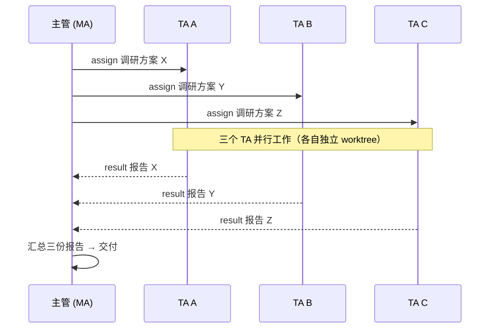

# Pan

> 一个入口，管理所有任务——只跟一个 Meta-Agent（meta-agent，简称 MA）对话，它拆解并调度一整支 task-agent（TA）团队并行干活。

**[English](./README.en.md) · 中文**

---
**[目录](#目录)**

**[快速开始](#快速开始)**

> 下面先用 30 秒看懂 Pan 的核心卖点与典型工作流；完
> 整的功能 / 配置 / API 参考手册见下方


**Pan 不是一个「非黑即白」的产品，而是一个光谱式的可扩展中间层**：往浅用，它是一个最小可用的「Session 与 Agent CLI 管理器」；往深用，它是完整可扩展的「Agent 集群管理协作系统 + MCP 工具层」——中间的每一档深度都由你按需启用，不是「全有或全无」（见「[Pan 是一个光谱](#-pan-是一个光谱从小到大按需取用)」）。

---
## 🧭 它是做什么的？（三句话讲明白）

- 👔 **一个主管（Meta-Agent，meta-agent，简称 MA）**：不亲自干活，负责招人、派活、听汇报、验收——像个项目经理。MA 是职责角色：它以一个 Session（持久编排身份）存在，实际运行在自己的 Worker 进程中。
- 🧑‍💻 **一群帮手（task-agent，TA）**：每个 TA 也以一个 Session（= 持久身份的 AI 会话）存在，有自己的记忆、人设和工具，在各自 workdir 干活，互不干扰；Worker 是实际运行 MA 或 TA 会话的临时 CLI 进程实例（进程是顺带的，可随时重建）。
- 🧍 **你站在中间**：像站在中控室大屏前的厂长——看得见每个帮手在干嘛，随时可以插话、改派，或者直接接管某个 Worker 的终端自己上手。

Pan 就是那个**调度台**：管进程、管会话、管记忆、管汇报，让"多个 AI 一起干活"从「手动在多个终端窗口之间来回切换」变成「一条有条不紊的流水线」。

## 💡 为什么选 Pan（30 秒看懂差异化）

单体的 AI 编程助手是"一对一"的：你说一句，它干一件，然后大眼瞪小眼。**Pan 让你只跟一个 MA（Meta-Agent）对话，就能同时指挥一整支 AI 帮手团队。**

| 你想解决的问题 | Pan 的答案 |
|---------------|-----------|
| **多任务并行**：同时推进几个模块/项目，手动切换多个终端窗口 | 👔 **MA 自动拆解派活**：拆不拆、怎么拆，编排方法论替你判断；多个 TA 在各自独立 git worktree 里并行干活 |
| **换 CLI 就丢上下文**：从 A 助手切到 B 助手，历史对话全没了，重头再来 | 🔁 **替身交接（session_handoff）**：想换就换，新 CLI 接管整个关系网，精简摘要随行——同任务跨 CLI 无缝继续，还省上下文 |
| **一个厂商锁死**：模型/助手被某个 CLI 生态绑定 | 🔌 **多 CLI 协议化适配**：cbc / kimi / opencode / claude / codex 已支持，集群对底层 CLI 无感知，写模型规则就能让 MA 按任务类型路由到合适的 adapter |
| **AI 没有记忆**：每次开工都要重新交代背景和偏好 | 🧠 **Memory + Character**：向量 + 全文混合检索，开工自动注入相关记忆；人设跨 Session 保持同一身份 |
| **AI 干到一半卡死**：进程挂了、任务跑飞了没人管 | 🐕 **Watchdog 自愈**：卡死 / 静默超时自动清理；进程异常死亡，落盘队列自动重建 Worker 接着干 |
| **人不在电脑前**：想用 QQ 遥控、公网远程查看 | 🚪 **多渠道指挥**：Web Dashboard / QQ / Cloudflare 公网隧道 / MCP，同一个调度台从哪儿都能进来 |

## 🌐 Pan 是一个光谱：从小到大，按需取用

上面看到的编排、收件箱、替身交接，都是 Pan 的「深水区」。但 Pan **不要求你一口气用到底**——它是一个从浅到深连续可扩展的中间层，你可以停在光谱上任何一档：

| 深度 | 你可以把 Pan 当作… | 这一层有什么 | 适合谁 |
|------|-------------------|-------------|--------|
| 🟢 **最小可用** | **Session 与 Agent CLI 管理器** | 多会话管理（创建 / 重命名 / 分支 / 删除）、多 CLI 适配（cbc / kimi / opencode / claude / codex）、历史会话导入、进程启停与终端接管、Web Dashboard | 个人开发者 / 小团队：只想统一管理手头的 AI CLI 会话，一个界面看清所有会话 |
| 🟡 **典型协作** | **多 Agent 协作调度台** | 上一档全部 + MA 编排（assign / claim / report-subscribe）、落盘收件箱、branch 分身、Memory + Character（记忆与人设）、Watchdog 自愈 | 重度 AI 用户：让 AI 分担多任务并行推进，团队「有记忆、坏不了」 |
| 🔴 **完整集群** | **Agent 集群管理协作系统 + MCP 工具层** | 上一档全部 + SMA 编排模板与完整方法论、并行 Worker 团队（各自独立 git worktree）、替身交接（跨 CLI 换人不丢上下文）、多渠道指挥（Web / QQ / Remote / MCP）、任意外部 Agent 经 MCP 接管编排 | 进阶玩家 / 自动化重度场景：AI 团队接管整条工作流，你只做拆解确认与验收 |

两个端点，一句话概括：

- **往浅用**：只开一个 Session、挂一个 CLI，Pan 就是一个顺手的「Session 与 Agent CLI 管理器」——你完全不必理解 MA、收件箱、编排这些概念，它们只是在后台等你；
- **往深用**：一键创建 SMA 模板会话，MA 拆解派活、一支 TA 团队并行干活、报告自动落盘投递——Pan 成为完整的「Agent 集群管理协作系统 + MCP 工具层」，任何支持 MCP 的外部 Agent 都能进来当主管。

关键在于：**每一档都建立在前一档之上，深度能力是叠加启用的，不是另一套系统。** 你今天把它当会话管理器用，明天想上编排，不需要迁移任何东西——只是开始用更多工具而已。下文介绍的所有功能都属于光谱中的某一层：用到哪层，读到哪层即可。

## 设计理念：降低认知负担

Pan 的出发点不是造一个更复杂的工具，而是减轻一种负担——注意力与认知的负担，无论它属于人，还是属于 agent。

我亲自从零一点点构思，开发了这套agent 管理、集群、调度与交流系统，并在这个系统刚刚可以使用起，我就Bootstrapping地用这套系统来开发它自己。过程中随着功能一点点增加，我能清晰的感受到：认知负担在两侧同时下降，效率与质量在两侧同时上升。

**人这一侧**：过去并行推进多个任务，要在七八个终端之间来回切换，注意力被迫分散，并行的体验极端痛苦；现在只需与一个 MA 对话，享受纯净的上下文。可以更加专注于决策，而不是看 agent 具体的行为，试错。MA 会筛选后上报具体的情况，我也可以快速定位需要注意的地方。注意力重新回到线性，人的决策变得更高效快速。

**agent 这一侧**：各司其职——MA 不会被细节的 context 淹没，拥有了更好的全局观；task-agent（TA）享受由具有全局观的 agent 写出的超高质量 prompt，返工比例大幅下降；而 MA 在拆解任务、安排并行与串行、划定依赖与边界上的编排能力，令人惊叹，让待办以意想不到的并行关系被解决。第一次看到它把一整页混乱的待办快速地排序，筛选出串行和并行的内容并一次性派出 7 个 worker 进程工作时，我终于完全相信了这个项目的价值。

最终结果是：效率至少提升了十倍。质量我无法量化衡量，但是相比于我最初一个终端一个终端地输入prompt，到这个系统的功能不断增多到如今，我个人的体验就像是从原始时代一步步走到了信息时代一样。

## 📖 一张表看懂全部概念

| 通俗说法 | 专业概念 | 说明 |
|---------|---------|------|
| 👔 项目经理 | **meta-agent（MA）/ SMA** | 不干活，只调度：招人、派活、听汇报、验收。角色，不是进程；以 Session 身份存在，运行在自己的 Worker 中（SMA 是 Pan 内置 MA 模板） |
| 🧑‍💻 执行任务的员工 | **task-agent（TA）** | 承接具体开发 / 测试 / 调研 / 文档任务的 agent，由 MA 经 `agent_assign` 派发；同样以 Session 身份存在、运行在 Worker 中 |
| 🧑‍💻 全职员工 | **stream Worker** | 长驻运行的 CLI 进程形态，随叫随到，可连续对话多轮，还能挂载 MCP 工具（Worker 是进程，不是身份；MA/TA 皆运行于 Worker） |
| 🧳 外包临时工 | **one-shot Worker** | 一次任务开一个新进程，自带全套工具箱，干完即走 |
| 🔌 不同的工具品牌 | **CLI Adapter** | 每种 CLI Agent 一个协议化适配器（cbc / kimi / opencode / claude / codex），切换不改业务层 |
| 🔁 替身接管你的工作 | **session_handoff** | 创建孪生 Session 接替旧会话：关系网 / 报告订阅 / QQ 绑定全移交，上下文精简摘要随行 |
| 📤 "这事交给你了，干完汇报" | **assign** | 异步派发：发完就去忙别的，完工后收到报告 |
| 📬 "以后有活自动派给你" | **report-subscribe** | 订阅制报告：TA 完工后自动把报告投到 MA 的收件箱（落盘不丢） |
| 🔗 "你归我管了" | **claim** | 建立主管 ↔ Session（TA）的双向管理绑定 |
| 🌿 复制一个分身去试另一条路 | **branch** | 从现有 Session fork 出独立分支，继承模型/记忆/工具，互不影响 |
| 🎛️ 老板抢过键盘自己上 | **takeover** | 把 AI 会话夺回人类终端亲自接管（进程重启 + 置 held） |
| 🧠 员工的长期记忆 | **Memory** | 向量 + 全文（FTS5）混合检索，开工前自动注入相关记忆 |
| 🎭 有性格的老员工 | **Character** | 人设 + 独立记忆库，跨 Session 保持同一身份 |
| 🐕 不睡觉的监工 | **Watchdog** | 每个 Worker 配一只：卡死 / 摸鱼超时自动清理；全局级还能自动补员 |
| 🖥️ 工位监控大屏 | **Dashboard** | 网页实时围观每个 Worker 的输出（React 唯一前端） |
| 💬 用 QQ 遥控 | **QQ Bridge** | 把 QQ 消息变成给 Worker 的指令；NapCat / LLOneBot 通道可切换 |
| 🌐 远程办公室 | **Remote** | Cloudflare Tunnel，把调度台暴露到公网 |

## 👔 Meta-Agent 编排：一支 AI 团队，一个主管

Meta-Agent 不是某个特殊的程序，而是一个**角色**——任何一方（你的 Agent CLI、脚本、甚至另一个 Pan 会话）只要满足三个条件（能发指令、能收情报、有身份），就能扮演"主管"（即 meta-agent，MA）。

在 Pan 里，"多任务并行"不是靠开多个终端窗口手动拼，而是把一条指令拆成一支并行 TA 团队——这是真实可运行的工作流：

```
你：项目 A 的三个模块并行开发，项目 B 的 bug 查一下，下午 3 点提醒我开会。

SMA（决策三问 → 拆解 → 派活）：
├─ ta-a1 · 项目 A · 模块 1 开发   （worktree-1）
├─ ta-a2 · 项目 A · 模块 2 开发   （worktree-2）
├─ ta-a3 · 项目 A · 模块 3 开发   （worktree-3）
├─ ta-b1 · 项目 B · 排查 bug
└─ ta-l1 · 生活 · 3 点开会提醒

你（过一会儿）：汇报进展。
→ SMA 收回全部结果，trust-but-verify 逐项验收，汇总成一份报告。
```

更妙的是，编排层对底层 CLI **无感知**：「什么任务派给哪个 CLI」写进 SMA 的模型规则即可路由——例如"重活走 cbc、轻量调研走 kimi、写作走 opencode"，集群本身无需任何改动。

> 完整的编排方法论（决策三问 / 并行派发 / 订阅制汇报 / trust-but-verify 验收 / 合并汇报）与内置 SMA 模板说明，见下文「[Meta-Agent 编排](#meta-agent-编排)」。

## 🔌 多 CLI 适配：喜欢哪个用哪个

Pan 的 Worker 不绑死在任何一个 CLI 生态里——每种 CLI Agent 对应一个实现 `CliAdapter` 协议的 adapter，Worker 与 Adapter 之间的契约统一：

- **想换就换**：不同任务交给不同 CLI（cbc / kimi / opencode / claude / codex），切换不改业务层，替身交接让上下文随行；
- **按任务类型路由**：写 SMA 的模型规则即可让"重活走 cbc、轻量调研走 kimi、写作走 opencode"，集群零改动；
- **新 CLI 接入成本低**：实现一个 `CliAdapter` 协议类（元信息 / 进程启动 / 消息编码 / 事件解析 / 接管五组方法）+ 注册一行。

各 adapter 的执行模式与接入细节见下文「[多 CLI 适配](#多-cli-适配)」。

## 🔁 替身交接：切换 CLI Agent，上下文随行

普通 Session **不能中途切换 adapter**——但现实中你会想换：这个助手用腻了、那个助手更擅长眼下这类任务。Pan 的答案是 **session_handoff（替身交接）**：创建孪生 Session 接替旧会话，一次交接完成三件事——

- **关系网整体移交**：新会话接管旧的 managed 关系网、`report_subscriptions` 订阅、QQ postbox 绑定——你的 AI 团队继续向新会话汇报，无需重建任何东西；
- **旧会话归档可读**：旧会话自动重命名为 `(archive) <原名>`，成为新会话的被管理会话，随时可读旧上下文；
- **只带精简摘要**：交接不复制完整历史，只携带交接简报——**避免长会话上下文膨胀，新会话轻装上阵**。

> **典型场景**：A 会话上下文已经几十万 token、继续对话要爆了 → 让 A 写一份交接简报 → `session_handoff` 生成精简的孪生会话 B，同一任务无缝继续；或者单纯想换个 CLI，历史上下文摘要随行。

## 🎯 一个入口，管理你的一切任务

你可能同时在忙的，是同一项目的几个并行子任务、几个不同项目的进展、甚至和生活相关的琐事（日程、提醒、自动化）。而对 MA 来说，它们都只是**可以并发调度的 TA 会话（及其 Worker 进程）**——你不必分别盯着每个终端：

对你来说，从头到尾只是一次对话；对它们来说，是一支并行协作的团队。而你随时保有最终指挥权——旁观、插话、接管，都可以。

## 📬 Managed 订阅：每个主管一个"AI 收件箱"

派出去的任务怎么收回结果？Pan 的答案是**订阅制 + 落盘队列**——把"逐个追问"变成"自动投递"：

- **订阅即接管**：订阅一个 Session 报告的同时，托管关系（claim）也一并建立——一步到位，不用分两步操作；
- **自动投递**：被托管的 TA 每次完成（或出错），报告自动投进 MA 的专属收件箱（`queue_pending`），不用挨个去问；
- **落盘不丢**：收件箱写在磁盘上——MA 中途掉线，重连后报告还在，一条不漏；
- **归属清晰**：每个 Session 只属于一个主管（`managed_by`），谁管的谁收，星形拓扑一目了然，别人也无法越权订阅。

所以对主管来说，管理一堆任务 = 管理一个收件箱：**派活 → 回来看收件箱 → 验收 → 合并汇报**。

## 🤝 多智能体协作：三种典型工作流

**① 并行 fan-out（一个主管，多个工人，同时开工）**



**② 串行流水线（上一环的产出是下一环的输入）**

```
assign(W1: 写技术方案) → 订阅报告 → 拿到方案 → assign(W2: 写代码) → 拿到代码 → assign(W3: 代码 review)
```

每一步等上一环的完成报告再走下一步，像工厂流水线一样可控。

**③ 长期共事（带记忆的老团队）**

给 Worker 挂上 Character（人设 + 记忆库）和 Memory 目录后，每次开工 Pan 都会把相关记忆自动注入上下文——你的 AI 团队会**记住项目背景、记住你的偏好**，而不是每次都从零开始。

## 🚪 从哪都能进来指挥：多渠道矩阵

同一个调度台，四种入口，随时切换：

| 通道 | 入口 | 说明 |
|------|------|------|
| 🖥️ **Web Dashboard** | `http://127.0.0.1:{port}` | React SPA（唯一前端）；根路径跳转 `/react/`，React 构建缺失时返回 503 |
| 💬 **QQ Bridge** | NapCat / LLOneBot | OneBot 11 网关**插件化**：两个通道只是 `QQChannel` 的薄子类，业务层零改动；`mirror` 全量镜像 / `selective` 选择性发送双模式 |
| 🌐 **Remote** | Cloudflare Tunnel | 一键暴露到公网，出门在外也能管 |
| 🔌 **MCP / WS** | `packages/mcp` + `/ws/agent` | 让任意 Agent CLI 当主管：MCP 工具 + 事件流订阅，MA 的接入通道 |

> 各通道的启动 / 配置 / 切换细节，见下文「[通道与集成](#通道与集成)」。

## ✨ 它凭什么值得一试

- 🌐 **光谱式可扩展**：浅用是「Session 与 Agent CLI 管理器」，深用是「Agent 集群管理协作系统 + MCP 工具层」——每一档深度叠加启用，按需取用，不是全有或全无。
- 🛡️ **自愈的调度台**：Worker 卡死？Watchdog 自动清理（静默超时 / 任务时长超时 / 空闲回收三档）；进程异常死亡？落盘队列会自动重建 Worker 接着干。
- 📬 **Managed 订阅收件箱**：每个主管都有一个落盘收件箱，被托管的 Worker 完工自动投递报告——派完活不用盯，回来看一眼收件箱就行。
- 🔁 **切换 CLI 不丢上下文**：替身交接让"换喜欢的 Agent"成为常态操作，同任务在不同 CLI 间无缝切换、节省上下文。
- 🔌 **不绑死任何 CLI 生态**：协议化 adapter + 集群无感知，新 CLI 接入是注册一行的事，MA 按模型规则路由。
- 🖐️ **人与 AI 平等**：任何一个 Worker，你都能随时中断、接管终端、fork 分身，或者直接上手。
- 🧠 **有记忆有性格**：Memory 向量 + 全文混合检索自动注入，Character 人设跨 Session 保持。
- 🚪 **跨通道指挥**：Dashboard、QQ、公网隧道、MCP——同一个调度台，从哪儿都能进来管。
- 🧩 **可当"工具底座"**：外部领域项目可以把服务接入 Pan，让 Pan 的 QQ Bot 和 Worker 替它打工（首个案例：RuleWhisper；`manifest.json` 的 `command_routes` 让 QQ 前缀命令直发外部 HTTP API，不走 LLM）。

---

## 目录

- [Pan](#pan)
  - [🧭 它是做什么的？（三句话讲明白）](#-它是做什么的三句话讲明白)
  - [💡 为什么选 Pan（30 秒看懂差异化）](#-为什么选-pan30-秒看懂差异化)
  - [🌐 Pan 是一个光谱：从小到大，按需取用](#-pan-是一个光谱从小到大按需取用)
  - [设计理念：降低认知负担](#设计理念降低认知负担)
  - [📖 一张表看懂全部概念](#-一张表看懂全部概念)
  - [👔 Meta-Agent 编排：一支 AI 团队，一个主管](#-meta-agent-编排一支-ai-团队一个主管)
  - [🔌 多 CLI 适配：喜欢哪个用哪个](#-多-cli-适配喜欢哪个用哪个)
  - [🔁 替身交接：切换 CLI Agent，上下文随行](#-替身交接切换-cli-agent上下文随行)
  - [🎯 一个入口，管理你的一切任务](#-一个入口管理你的一切任务)
  - [📬 Managed 订阅：每个主管一个"AI 收件箱"](#-managed-订阅每个主管一个ai-收件箱)
  - [🤝 多智能体协作：三种典型工作流](#-多智能体协作三种典型工作流)
  - [🚪 从哪都能进来指挥：多渠道矩阵](#-从哪都能进来指挥多渠道矩阵)
  - [✨ 它凭什么值得一试](#-它凭什么值得一试)
  - [目录](#目录)
  - [简介](#简介)
  - [特性](#特性)
  - [核心概念](#核心概念)
  - [快速开始](#快速开始)
    - [前置要求](#前置要求)
    - [安装与启动](#安装与启动)
    - [端口与环境变量](#端口与环境变量)
    - [首次使用：从 Dashboard 完成第一个任务](#首次使用从-dashboard-完成第一个任务)
      - [直接问 SMA：创建带参数的会话](#直接问-sma创建带参数的会话)
    - [首次使用 SMA：推荐工作流与边界](#首次使用-sma推荐工作流与边界)
    - [配置要点](#配置要点)
    - [停止与常见限制](#停止与常见限制)
    - [前端说明：React 是唯一前端](#前端说明react-是唯一前端)
  - [架构](#架构)
    - [模块划分](#模块划分)
  - [多 CLI 适配](#多-cli-适配)
  - [Meta-Agent 编排](#meta-agent-编排)
    - [树状任务管理](#树状任务管理)
    - [编排方法论](#编排方法论)
    - [编排层对底层 CLI 无感知](#编排层对底层-cli-无感知)
  - [配置](#配置)
  - [API 概览](#api-概览)
    - [HTTP（`packages/web/server.py`）](#httppackageswebserverpy)
    - [WebSocket](#websocket)
    - [MCP Server（`packages/mcp/server.py`）](#mcp-serverpackagesmcpserverpy)
  - [通道与集成](#通道与集成)
    - [Web / Dashboard](#web--dashboard)
    - [外部 Agent 调用 Pan（Meta-Agent / MCP）](#外部-agent-调用-panmeta-agent--mcp)
      - [MCP 工具一览](#mcp-工具一览)
      - [接入方式](#接入方式)
      - [给你的 Agent CLI 装上 pan skill（强烈建议）](#给你的-agent-cli-装上-pan-skill强烈建议)
    - [QQ Bridge](#qq-bridge)
    - [Remote（Cloudflare Tunnel）](#remotecloudflare-tunnel)
  - [⚠️ 安全提示](#️-安全提示)
  - [运行须知](#运行须知)
  - [文档](#文档)
  - [贡献](#贡献)
  - [许可证](#许可证)

---

## 简介

Pan 是一个 **CLI Agent 编排调度平台**（orchestrator）：Supervisor/Worker 架构下，一个「MA 主管」（meta-agent）通过 MCP 工具与 WebSocket 事件流，同时指挥多个 TA 会话（每个会话独立运行，由临时 Worker 进程承载）并行推进任务，每个 TA 在独立的 git worktree 中工作。你可以在 Web Dashboard、QQ、公网隧道或任意 Agent CLI 上指挥它，也随时可以旁观、插话或接管某个 Worker 的终端。

- **技术栈**：Python + FastAPI + WebSocket + SQLite（FTS5 全文检索）+ 可选 embedding 向量检索；前端为 React（唯一前端）。

传统的一对一 AI 编程助手是「你说一句，它干一件」。Pan 把这种模式升级为**一对多**：你只跟一个主管对话，主管同时调度多个 Worker 并行干活，再汇总成一份结果回报给你。

典型使用场景：

- **多任务并行**——同时推进同一项目的多个子任务、多个项目，乃至生活琐事（日程、提醒、自动化）；
- **多 CLI 并存**——不同任务交给不同 CLI Agent，切换 CLI 不丢上下文；
- **AI 有记忆**——向量 + 全文混合检索，开工自动注入相关记忆，人设跨 Session 保持；
- **多渠道指挥**——Dashboard / QQ / 公网隧道 / MCP 任意入口，操作同一个调度台。

## 特性

- **MA 编排（SMA 模板）**：一个主管完成「拆解 → 并行派发 → 订阅汇报 → trust-but-verify 验收 → 合并交付」的完整编排闭环。
- **多 CLI 协议化适配**：`CliAdapter` 协议 + 注册表，内置 **cbc / kimi / opencode / claude / codex** 五个 adapter，编排层对底层 CLI 无感知。
- **替身交接（session_handoff）**：切换 CLI 时创建孪生会话接替旧会话，关系网 / 订阅 / 报告随行，只携带精简摘要，避免上下文膨胀。
- **Managed 订阅收件箱**：订阅制报告落盘投递，主管「派完活回来看收件箱」，掉线重连不丢报告。
- **Worker 生命周期自愈**：`stream` / `one-shot` 双执行模式；Watchdog 三档超时清理 + 落盘队列在进程异常死亡后自动重建 Worker。
- **Memory + Character**：SQLite FTS5 + embedding 混合检索；人设（Character）与记忆库跨 Session 保持同一身份。
- **会话级 MCP**：每个 Session 可挂载自己的 MCP Server；内置 `pan`（编排工具集）与 `pan-qq`（QQ 工具集）两个 server。
- **多渠道接入**：Web Dashboard（React 唯一前端）、QQ Bridge（NapCat / LLOneBot 通道插件化）、Cloudflare Tunnel、任意 Agent CLI（WS + MCP）。
- **会话导入**：cbc / kimi / opencode / claude / codex 历史会话可导入复用，免去重新探索与初始化。

## 核心概念

> **三层模型**：**角色（MA/TA）— 身份（Session）— 进程（Worker）**。MA/TA 是职责角色；Session 是持久编排身份，承载 MA 或 TA；Worker 是临时 CLI 进程，实际运行 MA 或 TA 的 Session——既有 MA Worker 也有 TA Worker，不要把 Worker 与 TA 划等号。

| 概念 | 说明 |
|------|------|
| **MA（meta-agent）** | 编排角色：不亲自干活，只负责拆解、派活、听汇报、验收；以 Session 身份存在（内置 SMA 模板即 MA），运行在自己的 Worker 中 |
| **TA（task-agent）** | 执行角色：承接具体开发 / 测试 / 调研 / 文档任务；同样以 Session 身份存在、运行在 Worker 中 |
| **Session** | 持久编排对象（身份层，旧称 "Agent"）：持久身份（`ses_<16hex>`），拥有收件箱 `queue_pending`、agentLevel、managedBy 链；投递/编排语义都绑在它上面。独立于 Worker 生命周期 |
| **Worker** | 物理执行体（进程层）：临时 CLI 进程实例，实际运行某个 MA 或 TA 的 Session；`stream` 长驻 / `one-shot` 一次性两种形态，可随时 kill / 重建（进程是顺带的） |
| **CLI Adapter** | 每种 CLI Agent 一个协议化适配器（cbc / kimi / opencode / claude / codex） |
| **session_handoff** | 替身交接：创建孪生 Session 接替旧会话，关系网 / 订阅 / 报告随行 |
| **assign** | 异步派发任务（taskId 幂等），完工后收到报告 |
| **report-subscribe** | 订阅制报告：TA 完工自动把报告投到 MA 的落盘收件箱 |
| **claim** | 建立主管 ↔ Session（TA）的双向管理绑定 |
| **branch** | 从现有 Session fork 出独立分支，继承模型 / 记忆 / 工具 |
| **takeover** | 把 AI 会话夺回人类终端亲自接管 |
| **Watchdog** | 每个 Worker 一只：卡死 / 超时自动清理；全局级自动补员 |
| **Memory** | 向量 + 全文（FTS5）混合检索，开工前自动注入相关记忆 |
| **Character** | 人设 + 独立记忆库，跨 Session 保持同一身份 |
| **QQ Bridge** | QQ 消息 ↔ Worker 指令；NapCat / LLOneBot 通道可切换 |
| **Remote** | Cloudflare Tunnel，把调度台暴露到公网 |

## 快速开始

> 完整使用指南（安装 / 操作 / 编排 / API / 配置 / 排障）见[用户手册](docs/USER_MANUAL.md)。

下面按最终用户第一次使用的顺序说明：准备环境 → 安装依赖 → 生成配置 → 启动服务 → 打开 React Dashboard → 创建会话并发送第一条任务。

### 前置要求

- Python 3.14（开发环境为 3.14.5）
- Node.js + pnpm（构建 React 前端）
- 至少一个已安装并可从当前环境找到的受支持 Agent CLI：`cbc`（CodeBuddy CLI）、`kimi`、`opencode`、`claude`、`codex`

Pan 不负责安装第三方 Agent CLI。请在**启动 Pan 的同一个终端 / 用户环境**中任选至少一个 CLI 验证全局安装：

```bash
cbc --version
kimi --version
opencode --version
claude --version
codex --version
```

至少一条命令应输出版本号。Pan 启动时会逐个报告 CLI 的 `ready/unavailable` 状态；缺少某个可选 CLI 不会阻止 Pan 启动，但用对应 adapter 创建 Worker 时会提示安装、PATH 和重启问题。如果所有 CLI 都缺失，Worker 无法运行。后台服务的 PATH 可能和交互式终端不同，安装 CLI 或修改 PATH 后请重启 Pan；运行中的诊断可通过 `GET http://127.0.0.1:8768/api/cli/status` 查看。

> **前端说明**：React Dashboard 是唯一前端，访问根路径或 `/react/` 即可。

### 安装与启动

```bash
# 1. 安装最小依赖（仅核心，不含 Memory 的 ML 链）
pip install -r minimal-requirements.txt

# 2. 生成配置（所有字段可选，省略时使用默认值）
cp config.example.json config.json        # Windows: copy config.example.json config.json

# 3. 构建 React 前端（推荐；产物 → packages/web/dist/）
cd packages/web
pnpm install   # 首次
pnpm build
cd ../..

# 4. 启动
python main.py
# → http://127.0.0.1:8768
#   代码默认端口保持 8768；测试/隔离运行时使用 8767 或 8765；可用 PAN_PORT 覆盖

```

`minimal-requirements.txt` 只安装 Core/API/MCP 运行依赖，不包含 pytest、Memory ML 链或 QQ。开发测试时使用 `pip install -r dev-requirements.txt`；启用 Memory provider/索引能力时另装 `pip install -r memory-requirements.txt`。QQ 继续使用独立的 `packages/qq/requirements.txt`。根 `requirements.txt` 保留为兼容入口，会聚合运行时、开发测试和 Memory 可选层，但不会聚合 QQ。

**按平台选择启动方式**：

| 平台 | 安装依赖 | 启动 | 停止 |
|------|----------|------|------|
| Windows | 上文步骤 1-3（或 `scripts\setup.bat`） | `scripts\start_pan.bat`，或前台 `python main.py` | `scripts\stop_pan.bat`，或 Ctrl+C |
| macOS / Linux | `bash scripts/setup.sh`（首次） | `bash scripts/start.sh`（后台启动，PID 记 `data/process.pid`，日志 `data/pan.out.log`） | `bash scripts/stop.sh`（只杀记录的 PID + 进程组，绝不误伤其他 python） |

macOS / Linux 一键路径：

```bash
bash scripts/setup.sh   # 首次：装依赖 + 生成 config.json + 构建前端
bash scripts/start.sh   # 启动 → http://127.0.0.1:8768
bash scripts/stop.sh    # 停止
```

### 端口与环境变量

| 端口 | 用途 |
|------|------|
| 8768 | Pan 应用端口（代码默认；实用应用使用；由 `config.json` 的 `port` 控制） |
| 8767 / 8765 | `main` 或 `test` 工作树的测试/隔离运行端口，按需选择 |
| 8769 | Remote 状态服务（`remote.status_port`） |
| 8080 | QQ 插件（NoneBot）HTTP API，不对外 |
| 3001 / 3002 | NapCat / LLOneBot 正向 WS 网关 |
| 9740 | MCP server 的 SSE/streamable-http 默认端口 |

| 环境变量 | 默认值 | 说明 |
|----------|--------|------|
| `PAN_PORT` | — | 覆盖 `port` |
| `PAN_HOST` | `127.0.0.1` | 监听地址；改成非 loopback 会打印无鉴权告警 |
| `PAN_API_URL` | `http://127.0.0.1:8768` | MCP server 连接 Pan Core 的地址 |
| `PAN_URL` | `http://127.0.0.1:{port}` | QQ Bridge 访问 Pan Core 的地址 |
| `PAN_QQ_API_URL` | `http://127.0.0.1:8080` | pan-qq MCP 连接 QQ 插件的地址 |
| `PAN_QQ_PYTHON` | 平台默认 | QQ bot 解释器路径 |
| `PAN_QQ_MODE` | — | 覆盖 `qq.mode` |
| `ONEBOT_WS_URLS` / `ONEBOT_ACCESS_TOKEN` | — | QQ 通道 WS 地址 / token，可写入 `packages/qq/.env` |

代码默认访问 <http://127.0.0.1:8768>，面向用户的默认端口不变。开发测试或隔离运行 `main` / `test` 工作树时，应在本地 `config.json` 或 `PAN_PORT` 中选择 `8767` 或 `8765`，避免占用应用端口 8768。改端口后，浏览器地址、`PAN_API_URL` 和对应的 `PAN_AGENT_SESSION_ID` 所属 Pan 实例必须使用同一个端口。

### 首次使用：从 Dashboard 完成第一个任务

启动后在浏览器打开 <http://127.0.0.1:8768>。你会看到 React Dashboard：左侧是会话列表，右侧是聊天主区。

1. 在左侧栏点击 **New** 快速创建会话，或点击旁边的 ⚙ 打开新建会话配置弹窗；可设置 adapter（`cbc` / `kimi` / `opencode` 等）、会话名称、工作目录和会话模板。默认工作目录是 `data/workdirs/<会话名>`。
2. 创建后，会话卡片会显示状态点、adapter、模型和消息数。模型、权限模式、思考档位等设置可以稍后在会话设置中修改。
3. 选中会话，点击顶栏 **Start** 启动 Worker；在底部输入任务并按 **Enter** 发送，Shift+Enter 换行。Worker 忙碌时消息会进入发送队列，空闲后按顺序处理。
4. 状态点含义为：绿色 idle、蓝色 running、黄色已被人工接管、红色 error。回复会逐条显示，工具调用可在右侧 DetailPanel 查看原始输出。
5. 任务完成后可继续多轮追问，或切换到 **Editor** 浏览/编辑会话工作目录中的文件；不再需要时右键会话 → Delete。完整 UI 操作见[用户手册第 5 章](docs/USER_MANUAL.md#5-dashboard-界面操作)。

#### 直接问 SMA：创建带参数的会话

在 Web Dashboard 中点击“新建带参数的 session”，先创建一个可配置的会话：


在模板列表中选择 `SMA(NoAdapter)`。这里务必选择 `NoAdapter` 版本，之后才能按需要自行配置 adapter：

.png>)

创建完成后，直接向 SMA 提问「怎么玩转 Pan？」即可让它调用 `pan_handbook`，边讲解边演示 Pan 的编排能力。

### 首次使用 SMA：推荐工作流与边界

推荐只和一个 `SMA(NoAdapter)` 主管会话对话，把目标、边界和验收标准交给它。它会先判断是否值得拆解；需要并行时，创建并自动管理子会话，派发任务并订阅报告，最后做 trust-but-verify 验收后交付合并结果。典型流程是：

1. 新建会话，模板选择 **SMA(NoAdapter)**；
2. 提出目标，例如“并行调研方案 A / B / C，分别给出结论，最后汇总对比报告”；
3. SMA 使用 `session_create`、`agent_assign`、`report_subscribe` 管理子会话，完成报告进入它的 `queue_pending` 收件箱；
4. SMA 汇总并验收后向你交付结果，必要时用 `session_batch_delete` 清理子会话。

简单问题或改一行代码可以直接使用普通会话；多任务并行、需要汇总交付或长期协作时更适合交给 SMA。子会话删除不会删除磁盘上的 workdir，需保留产物时请先落盘。完整建议见[用户手册第 4 章](docs/USER_MANUAL.md#4-两种获得meta-agent能力的方式)。

### 配置要点

配置文件是仓库根目录的 `config.json`（已 gitignore），模板为 `config.example.json`；所有字段可选。编辑后通常重启 `python main.py` 生效，适配器、worker、plugin、memory 部分也支持在 UI 全局设置中热重载。

```json
{
  "port": 8768,
  "cbc": { "model": "deepseek-v4-flash", "models": [], "permission_mode": "bypassPermissions" },
  "worker": { "timeout_sec": 300, "task_timeout_sec": 1800, "idle_sec": 300 }
}
```

- `models: []` 表示自动识别 CLI 可用模型；填写后会限制 UI 中的可选模型。
- `bypassPermissions` 默认不逐条审批命令和文件修改，适合可信环境；`default` / `acceptEdits` 更保守。Pan 默认无鉴权并绑定 `127.0.0.1`，不要把 `PAN_HOST` 改为公网地址而不做额外保护。
- `worker.timeout_sec` 是无输出静默超时，`task_timeout_sec` 是 stream 任务总时长上限，`idle_sec` 是任务完成后的空闲回收时间。

QQ 需要先运行 NapCat（3001）或 LLOneBot（3002），在 `qq.channel` 选择网关；`qq.mode` 为 `mirror` 时自动回复，为 `selective` 时只进收件箱由编排者处理。不使用 QQ 时可设置 `qq.enabled=false`。MCP 会话级注入、外部 Agent 接入和完整字段表见[用户手册第 4、12 章](docs/USER_MANUAL.md#12-mcp模板和端口对齐排障)。

### 停止与常见限制

Ctrl+C 可优雅退出；也可使用 `scripts/stop_pan.bat` / `scripts/stop.sh`。macOS/Linux 路径大小写敏感；后台启动时 PATH 可能不同，修改 CLI 或 PATH 后要重启 Pan。API 默认无鉴权，Remote/Cloudflare Tunnel 会把主端口暴露到公网；使用前必须评估风险。Worker 被 watchdog 回收后可重新 Start，Session 历史仍会保留；删除 Session 不会删除其 workdir。更多排障见[用户手册第 12、13 章](docs/USER_MANUAL.md#13-安全清理与常见问题)。

### 前端说明：React 是唯一前端

**React 前端是唯一前端**：完成上面的步骤 3 构建后，直接访问 `http://127.0.0.1:{port}`（307 重定向到 `/react/`）。

开发模式下可用 Vite HMR 热更新：

```bash
cd packages/web
pnpm dev       # 开发模式：Vite HMR + 代理到后端
```

路由不再由前端配置控制：根路径固定跳转 `/react/`。如果 `packages/web/dist/` 不存在，根路径和 `/react/` 返回清晰的 503；执行 `cd packages/web && pnpm build` 后即可恢复。

## 架构

```
         Meta-Agent (MA)              人类                    远程访问
    (Agent CLI / MCP)           (Dashboard)            (Cloudflare Tunnel)
          │                          │                          │
   /ws/agent + MCP tools       /ws + HTTP               公网 URL + WS
    （事件流 + 命令）          （观察 + 注入 + 接管）     （Dashboard / QQ Bot 外部接入）
          │                          │                          │
          └──────────┬───────────────┘                          │
                     │                                          │
            ┌────────▼────────┐                                 │
            │  Pan Core         │◄──────────────────────────────┘
            │  (FastAPI 服务)    │        HTTP / WebSocket
            │                   │
            │  Session Manager │
            │  ├─ Worker-1     │── CliAdapter 协议（cbc / kimi / opencode / claude / codex）
            │  ├─ Worker-2     │── ...（互不感知，按 adapter 名路由）
            │  └─ Worker-N     │
            │                   │
            │  Character 框架   │── profile → character → memory
            │  Memory 子系统    │── SQLite + FTS5 + embedding 检索
            │  Event Bus       │─── WS 广播
            │  Session Store   │─── JSON 持久化
            └──────────────────┘
```

### 模块划分

| 目录 | 职责 |
|------|------|
| `packages/core/` | Core 模块：进程管理 + 消息路由 + Memory + Adapter。所有外部模块仅通过 HTTP/WS API 与 Core 通信 |
| `packages/web/` | Web 通道：FastAPI 路由 + WebSocket + Dashboard（约 99 个 HTTP 路由，2026-09-03 统计） |
| `packages/qq/` | QQ 通道：NoneBot2 桥接 + 通道插件化 + pan-qq MCP |
| `packages/mcp/` | MCP Server：编排工具集 + pan-qq，可独立启动 |
| `packages/remote/` | Cloudflare Tunnel 远程通道 |
| `scripts/` | 启动 / 停止 / 隧道 / 预提交脚本 |
| `docs/` | 文档（git 跟踪；`docs/skills/pan/SKILL.md` 是编排知识单一事实源） |
| `tests/` | 测试（63 个 Python 测试文件 + conftest，`python -m pytest tests/ -q` 收集 806 项，2026-09-03 统计） |

## 多 CLI 适配

Worker 与具体 CLI 解耦：每种 CLI Agent 对应一个实现 `CliAdapter` 协议（`packages/core/adapters/base.py`，元信息 / 进程启动 / 消息编码 / 事件解析 / 接管五组方法）的 adapter，启动时在注册表（`packages/core/adapters/registry.py`）中按名注册。

| Adapter | CLI | 执行模式 | 说明 |
|---------|-----|---------|------|
| `cbc` | CodeBuddy CLI | stream + one-shot | 原生 JSON 流协议，主力 adapter |
| `kimi` | Kimi CLI | stream（wrapper 长驻） | wrapper 内逐条 `kimi -p` |
| `opencode` | OpenCode CLI | stream（wrapper 长驻） | wrapper 内逐条 `opencode run --format json` |
| `claude` | Claude Code CLI | stream + oneshot | 默认 `--input-format stream-json`；可选 `outputMode: "oneshot"`，MCP 经 `--mcp-config` 注入 |
| `codex` | OpenAI Codex CLI | stream（wrapper 长驻） | wrapper → 原生 `codex app-server --stdio` 长驻桥（thread/turn 原生语义），不再逐轮 `codex exec`；MCP 经 `-c mcp_servers.*` 内联注入（零文件污染） |

配套的 `SessionsProvider` 协议（`packages/core/adapters/base.py`）把各 CLI 的原生会话存储（历史 / usage / 标题 / fork）统一为同一套读写接口；server 按 adapter 名取 provider，新增一个 CLI 无需再写 import / branch / rename 的分派逻辑（`/api/adapters/{adapter}/sessions[/import]` 通用端点）。

模型配置遵循「少配」原则：`config.json` 中 `models` 字段**不填 = 自动识别**该 CLI 的可用模型（cbc 解析 `--help`、kimi 解析 config.toml），**填写 = 限制可用模型**。

## Meta-Agent 编排

Meta-Agent 不是某个特殊程序，而是一个**角色**（meta-agent，MA）——任何一方（你的 Agent CLI、脚本、甚至另一个 Pan 会话）只要满足三个条件即可扮演「主管」：

1. **能发指令**：通过 MCP 工具（如 `agent_spawn` / `agent_assign` / `agent_send` / `session_handoff`，兼容别名 `worker_*`）或 HTTP API；
2. **能收情报**：通过 WebSocket 订阅事件流（`worker.result` / `worker.status` / `worker.crashed`…），或订阅制报告落盘到自己的收件箱；
3. **有身份**：Pan 记录谁在指挥，并对 Worker 做隔离防止越权。

Pan 内置 **SMA（Super Meta Agent）编排模板**（`manifest.json` 的 `session_templates.SMA`）：一键创建「超级编排代理」会话，挂载 Pan 核心 MCP 与 QQ 通道 MCP，全权限 + 自动认领 + 自动订阅，开箱即用的 AI 项目经理。

### 树状任务管理

Pan 的树状管理 UI 展示 SMA 与其子 session / Worker 的管理关系：SMA 位于树的上层，负责拆解和派发任务；子 session / Worker 位于下层，分别承接具体工作并回传状态与结果。这样可以在一个视图中查看主管、任务与执行者之间的层级关系。


### 编排方法论

SMA 的调度遵循一套方法论（固化在 `docs/skills/pan/SKILL.md`）：

1. **决策三问**——先判断拆不拆：① 能真并行吗？② 拆了更快吗？③ 精度关键吗？任一不过 → 自己做；全过 → 并行派发；
2. **并行派发**：`agent_assign` 异步分发到多个 TA 会话（各自独立 git worktree，避免提交冲突），立即返回不阻塞；
3. **订阅制汇报**：`report_subscribe` 把完成报告自动投进主管的落盘收件箱，掉线重连报告不丢；
4. **trust-but-verify 验收**：合并汇报前逐项核对改动、跑测试验证；
5. **合并汇报**：收回全部结果，汇总成一份交付。

### 编排层对底层 CLI 无感知

SMA 只通过 MCP 工具 / WS 事件流与 Worker 通信，不知道也不关心 Worker 底下跑的是哪个 CLI。因此「什么任务派给哪个 CLI」是**可配置**的：通过写 SMA 的模型规则（system prompt），即可按任务类型路由——例如「重活走 cbc、轻量调研走 kimi、写作走 opencode」，集群本身无需任何改动。

## 配置

配置文件为仓库根目录的 `config.json`（gitignored），模板见 `config.example.json`。所有字段可选，省略时使用 `packages/core/config.py` 内置默认值。

| 配置 | 默认值 | 说明 |
|------|--------|------|
| `port` | 8768 | 主服务端口默认值（面向用户保持 8768；测试/隔离运行时改为 8767 或 8765） |
| `cbc.model` | `deepseek-v4-flash` | cbc 默认模型 |
| `cbc.models` | `[]` | 不填 = 自动识别（cbc `--help` 解析）；填写 = 限制可用模型 |
| `cbc.permission_mode` | `bypassPermissions` | cbc 权限模式 |
| `kimi.model` | `moonshot-cn/kimi-k2.6` | kimi 默认模型 |
| `kimi.models` | `[]` | 不填 = 自动识别（config.toml 解析）；填写 = 限制可用模型 |
| `worker.timeout_sec` | 300 | queued 静默超时 / 运行中无输出读取超时 kill 秒数 |
| `worker.task_timeout_sec` | 1800 | stream running 任务运行时长上限（长思考 / 大文件读取不误杀） |
| `worker.idle_sec` | 300 | 空闲回收秒数（held / zombie 跳过） |
| `python` | `""` | Pan Core、Pan 内部 worker wrapper 和 `pan` / `pan-qq` stdio MCP server 使用的解释器；优先于 `PAN_PYTHON`，空值回退到环境变量和当前解释器 |
| `qq.enabled` | true | 是否启动 QQ bot（main.py 按此统一 spawn / 终止） |
| `qq.mode` | `mirror` | `mirror` 全量镜像自动回复 / `selective` 选择性发送（消息只进 inbox，由 MA 经 pan-qq MCP 决策） |
| `qq.channel` | `napcat` | QQ 通道：`napcat` / `llonebot`（OneBot 11 网关插件化切换） |
| `remote.enabled` | false | 是否启用 Cloudflare Tunnel；不控制 Pan Core、Web UI 或普通 `/api/*`（即使为 false，主服务仍按 `port` 启动） |
| `remote.quick_tunnel` | true | true 用临时 URL；false 用 named tunnel（需 `remote.config_path`） |
| `remote.status_port` | 8769 | Remote 状态服务端口 |
| `logging` | INFO / `data/logs/pan.log` | 日志级别、轮转、控制台输出 |
| `startup.console_hidden` | false | `scripts\start_pan.bat` 是否隐藏独立 Pan 控制台；默认显示启动和运行日志窗口，设为 `true` 可隐藏 |
| `plugin_manifests` | `["manifest.json", "packages/mcp/manifest.json"]` | 根项目模板 + Pan MCP 清单；外部/private manifest 可在本地 config.json 追加 |

`python` 是 Pan 自身解释器的规范配置字段。字符串适合直接填写
`"D:\\Tools\\Python 3.14\\python.exe"`；需要保留 launcher 参数时使用
`{"command":"py","args":["-3"]}`。解析优先级为
`config.json python` > `PAN_PYTHON` > 当前运行 Pan 的 `sys.executable`。空值、无效路径或不可执行候选会记录不含原始值的警告并尝试下一层，不能生成坏的 MCP/worker 命令。
`POST /api/config/reload` 的 `{"scope":"python"}` 可重新读取并返回非敏感来源元数据；正在运行的 CLI 不热切换，新 worker/respawn 和新 MCP descriptor 使用新值。

**环境变量**：

| 变量 | 默认值 | 说明 |
|------|--------|------|
| `PAN_PORT` | — | 覆盖 `port` |
| `PAN_HOST` | `127.0.0.1` | 监听地址 |
| `PAN_URL` | `http://127.0.0.1:{port}` | QQ Bridge 访问 Pan Core 的地址 |
| `PAN_API_URL` | `http://127.0.0.1:8768` | MCP server 连接 Pan Core 的地址 |
| `PAN_PYTHON` | — | `config.json` 顶层 `python` 未配置或无效时的次优先级解释器；仅影响 Pan-owned Python 启动，不覆盖 `python` |
| `PAN_QQ_API_URL` | `http://127.0.0.1:8080` | pan-qq MCP 连接 QQ bot 的地址 |
| `PAN_QQ_PYTHON` | miniforge | QQ bot 解释器路径 |
| `PAN_QQ_MODE` | — | 覆盖 `qq.mode` |
| `ONEBOT_WS_URLS` / `ONEBOT_ACCESS_TOKEN` | — | 覆盖 QQ 通道连接地址 / token |

## API 概览

### HTTP（`packages/web/server.py`）

> 约 99 个 HTTP 路由（2026-09-03 统计）；完整字段与请求体见 [`docs/skills/pan/references/http-api.md`](docs/skills/pan/references/http-api.md)。

**Session 管理**

```
GET    /api/sessions                    → 列举所有 Session（?summary=1 精简）
POST   /api/sessions                    → 创建 Session
GET    /api/sessions/{id}               → 获取 Session 详情
GET    /api/sessions/{id}/history       → 获取历史消息（分页）
GET    /api/sessions/{id}/managers      → 上级 manager 链
PATCH  /api/sessions/{id}               → 更新 Session（含 requireRestart 语义）
POST   /api/sessions/{id}/rename        → 重命名
POST   /api/sessions/{id}/branch        → 分支 Session
POST   /api/sessions/{id}/handoff       → 替身交接（创建孪生 Session 接替）
DELETE /api/sessions/{id}               → 删除 Session
POST   /api/sessions/batch-delete       → 批量删除
POST   /api/sessions/order              → 持久化自定义显示顺序（前端拖拽排序）
```

**会话队列（持久 inbox，`queue_pending`）**

```
GET    /api/sessions/{id}/queue         → 服务端队列快照（仅仍 queued 的项）
POST   /api/sessions/{id}/queue         → 用户消息入队（返回 queueItemId，落盘确认）
PATCH  /api/sessions/{id}/queue/order   → 重排整个队列
PATCH  /api/sessions/{id}/queue/{item_id}  → 编辑队列项（仅 user 源、queued）
DELETE /api/sessions/{id}/queue/{item_id}  → 删除队列项
POST   /api/sessions/{id}/queue/{item_id}/retry → 重试（保留原 queueItemId）
```

**Worker 管理**

```
POST   /api/spawn                       → 启动新 Worker
POST   /api/task                        → 向 Worker 发送任务
POST   /api/kill/{worker_id}            → 停止 Worker
GET    /api/list                         → 列举活跃 Worker
POST   /api/worker/{id}/restart         → 重启 Worker
POST   /api/worker/{id}/settings        → 更新 Worker 配置
POST   /api/worker/{id}/rename          → 重命名 Worker
POST   /api/worker/{id}/branch          → Worker 分支
POST   /api/worker/{id}/interrupt       → 中断 Worker（仅 running 时）
POST   /api/worker/{id}/takeover        → 接管 Worker 终端（重启 + 置 held）
GET    /api/worker/{id}/takeover-command → 生成接管命令（不执行）
```

**编排**

```
POST   /api/assign                      → 异步派发任务（taskId 幂等）
POST   /api/notify                      → 持久化后台任务通知（agent_notify 后端）
POST   /api/report-subscribe            → 订阅 Worker 报告（同时建立 managed 关系）
POST   /api/report-unsubscribe          → 退订报告
POST   /api/claim                       → 绑定 managed 关系（可一键把 Session 拖入对方管理）
POST   /api/unclaim                     → 解除 managed 关系（同时退订报告）
POST   /api/readonly                    → 对已管理 Session 设置/清除只读（拒绝外来任务）
```

**QQ 绑定**

```
POST   /api/qq/subscribe                → Pan session 订阅某 QQ 会话 inbox 更新提醒
POST   /api/qq/unsubscribe              → 取消订阅
POST   /api/qq/notify                   → QQ 插件上报 inbox 更新
GET    /api/qq/contacts                 → 最近 QQ 联系人 / 群
```

**Character / Memory**

```
GET    /api/characters/profiles         → 列出可用 Profile（session templates）
GET    /api/manifest/command-routes     → 列出 QQ 命令路由
GET    /api/characters                  → 列出 Character
POST   /api/characters                  → 创建 Character
GET    /api/characters/{id}             → 获取 Character 详情
DELETE /api/characters/{id}             → 删除 Character
POST   /api/memory/index                → 索引记忆目录（.md → SQLite）
GET    /api/memory/search               → 混合检索记忆
GET    /api/memory/stats                → 记忆库统计
POST   /api/memory/inject               → 手动注入记忆
```

**文件系统（session workdir 内，含路径逃逸校验）**

```
GET    /api/fs/list                     → 列出目录
GET    /api/fs/read                     → 读取文件
POST   /api/fs/write                    → 写入文件
POST   /api/fs/rename                   → 重命名
POST   /api/fs/delete                   → 删除
```

**Adapter / 导入**

```
GET    /api/models?adapter=codex        → 获取 Codex 模型列表（adapter 可为任一已注册 adapter）
GET    /api/adapter/config?adapter=cbc  → Adapter 配置
GET    /api/adapters                    → 列举可用 Adapter
GET    /api/cli/status                  → 检查当前 Pan 进程能否找到各 Agent CLI
GET    /api/adapters/{adapter}/sessions[/import] → 通用会话导入 / 浏览
GET    /api/cbc/projects                → CBC 项目列表
GET    /api/cbc/sessions                → CBC Session 列表
GET    /api/cbc/browse                  → 浏览 CBC Session 文件
POST   /api/cbc/sessions/import         → 导入 CBC Session
GET    /api/kimi/workspaces             → Kimi Workspace 列表
GET    /api/kimi/sessions               → Kimi Session 列表
POST   /api/kimi/sessions/import        → 导入 Kimi Session
GET    /api/opencode/sessions           → OpenCode Session 列表
POST   /api/opencode/sessions/import    → 导入 OpenCode Session
```

**设置 / Manifest / 模板**

```
GET    /api/settings/ui                 → 读取全局显示设置
PUT    /api/settings/ui                 → 保存全局显示设置
GET    /api/session-templates           → Session 模板列表（manifest）
GET    /api/mcp/servers                 → Manifest 中可选 MCP Server 列表
POST   /api/manifest/reload             → 强制热重载 manifest
GET    /api/worker/{id}/takeover-command → 生成 takeover 命令
```

### WebSocket

```
WS   /ws           Dashboard：接收 user_inject（入队）/ worker_control / sync_interactive（交互快照回放）；广播全部事件
WS   /ws/agent     MA（meta-agent）：subscribe（按 eventTypes / sessionIds 过滤 + 重连补发）、
                   reconnect、task、spawn、assign、send、kill、list
```

广播事件：`worker.stream` / `worker.result` / `worker.status` / `worker.spawned` / `worker.crashed` / `worker.zombie` / `worker.destroyed` / `worker.restarted` / `worker.reconfigured`、`session.created` / `session.updated` / `session.renamed` / `session.deleted` / `session.orderUpdated` / `sessions.deleted`、`queue.item_added` / `queue.item_updated` / `queue.item_removed` / `queue.snapshot`、`error`。完整协议见 `docs/skills/pan/references/ws-protocol.md`。

### MCP Server（`packages/mcp/server.py`）

`pan` server（编排工具集，工具表见「[外部 Agent 调用 Pan](#外部-agent-调用-panmeta-agent--mcp)」）+ 独立 `pan-qq` server（QQ 通道，`packages/qq/mcp.py`）。

启动方式：`python -m packages.mcp.server --transport stdio|sse|streamable-http [--port 9740]`（默认 stdio，API 地址取 `PAN_API_URL`）。

## 通道与集成

### Web / Dashboard

- `http://127.0.0.1:{port}` — 307 重定向到唯一的 React Dashboard `/react/`
- `ws://127.0.0.1:{port}/ws` — Dashboard WebSocket
- `ws://127.0.0.1:{port}/ws/agent` — Meta-Agent WebSocket

### 外部 Agent 调用 Pan（Meta-Agent / MCP）

Pan 不只给人用——**任何支持 MCP（Model Context Protocol）的外部 agent**（CodeBuddy、Claude Code、自定义脚本 agent……）都可以接管 Pan 的完整编排能力：会话管理、TA 派发、报告订阅、QQ 收件箱消费，扮演「MA 主管」角色。也可以直接连 `/ws/agent` WebSocket 订阅事件流。

#### MCP 工具一览

**`pan` server**（`packages/mcp/server.py`，编排核心）：

| 工具 | 功能 |
|------|------|
| `session_create` | 创建 Session（只建会话，不启动 worker） |
| `session_import` | 浏览 / 导入既有 CLI 会话（支持 cbc / kimi / opencode / claude / codex；list_projects / list_workspaces / list_sessions / import 四个 action） |
| `session_list` | 列出全部 Session（`summary=true` 返回摘要，避免全量 history） |
| `session_managed` | 返回调用方管理的 Session 概要（归属巡检） |
| `manager_chain` | 返回调用方的上级 manager 链 |
| `session_get` | 获取单个 Session 完整详情（含 history 与最近 result） |
| `session_update` | 更新会话设置（model / permissionMode / effort / MCP / outputMode 等） |
| `session_delete` | 删除 Session 并 kill 其 worker |
| `session_batch_delete` | 批量删除（kill worker、清理跨会话引用） |
| `session_handoff` | 替身交接：创建孪生 Session B 接替 A（精简上下文 / 换 adapter） |
| `session_readonly` | 为当前 manager 管理的 Session 设置或清除持久只读状态；不会自动认领目标 |
| `session_claim` / `session_claim_many` | 认领会话建立 managed 关系（自动订阅报告；批量版逐项隔离） |
| `session_unclaim` / `session_unclaim_many` | 解除 managed 关系（同时退订报告；批量版逐项隔离） |
| `session_history` | 分页读取会话历史 |
| `session_qq_subscribe` / `session_qq_unsubscribe` | 订阅 / 退订 QQ 会话 inbox 更新提醒（`@@@@by qq` 推送到收件箱） |
| `report_subscribe` / `report_unsubscribe` | 订阅 / 退订被管会话的完成报告（自动投递到调用方收件箱，掉线不丢） |
| `agent_spawn` | 为 Agent（= Session）启动 worker 进程（一等工具） |
| `agent_task` | 给 Agent 发任务（无活 worker 自动 spawn） |
| `agent_assign` | 异步派发任务，立即返回（编排首选；taskId 幂等） |
| `agent_send` | 向 Agent 发消息（多轮协作，排队不打断；无活 worker 入持久队列待投） |
| `agent_send_force` | 强制推送：重启 worker 再发（`agent_send` 送不到时的兜底；无活 worker 直接入队） |
| `agent_kill` | 终止 Agent 的 worker 进程（Agent 数据保留；无活 worker 时无害 no-op） |
| `agent_list` | 列出全部 Agent（= Session 摘要，`session_list` 的别名） |
| `agent_notify` | 向自己或自己管理的 Agent 持久化投递后台任务完成/状态通知；不是普通任务派发替代品 |
| `worker_spawn` / `worker_task` / `worker_assign` / `worker_send` / `worker_send_force` / `worker_kill` / `worker_list` | **兼容别名（DEPRECATED）**：内部复用 `agent_*` 同一实现，建议改用 `agent_*`；仅 `worker_id` 进程寻址为别名独有遗留路径 |
| `model_list` | 列出任一已注册 adapter 的模型；必须显式传 adapter，例如 `model_list(adapter="codex")`，省略时返回 adapter 清单与结构化错误 |
| `pan_handbook` | 返回完整 Pan 编排手册（`docs/skills/pan/SKILL.md`） |

**`pan-qq` server**（`packages/qq/mcp.py`，QQ 通道）：

| 工具 | 功能 |
|------|------|
| `qq_send_message` | 向指定 QQ 会话发消息（私聊 / 群聊） |
| `qq_read_conversation` | 读取 QQ 会话对话记录（本地落盘，非框架缓存） |
| `qq_read_inbox` | 读取 QQ 会话待处理消息（selective 模式下由编排者消费） |
| `qq_list_contacts` | 列出可联系的 QQ 会话（好友 / 群合并去重） |
| `qq_send_file` | 向 QQ 私聊/群聊发送文件（本地路径或 URL） |
| `qq_bind` / `qq_unbind` | 绑定 / 解绑当前 Pan session 到 QQ 会话（订阅其 inbox 更新提醒） |

#### 接入方式

**方式 A：作为 Session 的 MCP server 挂载（推荐，自动注入）**

创建 session 时指定 `mcpServers: ["pan"]`（或使用自带 MCP 的模板如 SMA），adapter 在 spawn worker 时自动生成会话级 MCP 配置并注入，无需手工接线：

- cbc / claude：写 `data/mcp-configs/<sid>.mcp.json`，spawn 参数追加 `--mcp-config`
- kimi：写会话级隔离 home（`data/kimi-homes/<sid>/`），经 `--kimi-home` 加载
- opencode：写项目级 `opencode.json`
- codex：`-c mcp_servers.*` 内联注入（零文件污染）

注入时同时带上 `PAN_AGENT_SESSION_ID` / `PAN_AGENT_SESSION_TITLE` 环境变量——MCP 工具据此识别调用方身份（managed 隔离判定、report 投递目标）。**注意三对齐**：MCP server 连接的 Pan API 地址（`PAN_API_URL`，默认 `http://127.0.0.1:8768`）必须与 `PAN_AGENT_SESSION_ID` 所在 Pan 实例一致。

**方式 B：独立进程接入（任意 MCP 客户端）**

```bash
# stdio（本地 CLI 客户端，如在 .mcp.json / --mcp-config 里声明 command）
PAN_API_URL=http://127.0.0.1:8768 python -m packages.mcp.server --transport stdio

# SSE / streamable-http（远程或多客户端）
python -m packages.mcp.server --transport sse --port 9740
```

独立进程没有 `PAN_AGENT_SESSION_ID`，依赖调用方身份的工具（`session_claim` / `report_subscribe` / `manager_chain` 等）不可用；完整编排体验建议走方式 A，或配合 `/ws/agent` WebSocket 使用。

编排方法论与实战手册见 `docs/skills/pan/SKILL.md`（`pan_handbook` 工具可直接取用）。

#### 给你的 Agent CLI 装上 pan skill（强烈建议）

**pan skill**（`SKILL.md`）是给「想当 MA（meta-agent）主管」的 agent 准备的**冷启动手册**：把它配给你的 agent CLI 后，agent 开工即自动掌握 Pan 的编排链路（`session_create → report_subscribe → agent_assign → queue_pending`）、MCP 工具约定与踩坑，**无需你每次在提示词里从头教**——与 MCP 工具（方式 A 注入）配合，agent 即可直接上手当主管。

- **主源**：`docs/skills/pan/SKILL.md`（git 跟踪，随仓库更新）；
- **支持 Agent Skills 的 CLI**（如 Claude Code 的 `.claude/skills/`、Codex 的 `~/.codex/skills/` 、cbc的 `.codebuddy/skills/`等）：把 `pan/SKILL.md` 按该 CLI 的 skill 目录约定放好即可。frontmatter 的 `name` / `description` 是 skill 的元信息（description 影响触发时机，建议保留原名）。

### QQ Bridge

依赖见 `packages/qq/requirements.txt`（nonebot2 + onebot-adapter-onebot + httpx）。启动：

1. 启动所选网关：NapCat（正向 WS 服务端，端口 3001）或 LLOneBot（端口 3002），由 `config.json` 的 `qq.channel` 指定；
2. `python main.py`（或 `scripts/start_pan.bat`）——main.py 按 `config.json` 的 `qq.enabled` 自动 spawn / 终止 QQ bot（`packages/qq/bot.py`，PID 写入 `data/qq_bot.pid`），无需手动启动。

> 注意：QQ bot 运行在 miniforge 解释器（NoneBot 未装在项目 .venv），可用 `PAN_QQ_PYTHON` 覆盖。

QQ 接入被抽象为可切换的**通道（Channel）**：`QQChannel` 接口（`packages/qq/channels/base.py`）定义生命周期 / 消息回调 / 收发 / 联系人查询；NapCat 与 LLOneBot 都是 OneBot 11 网关的薄子类（`packages/qq/channels/`），业务层只依赖接口，切换网关零改动。

`qq.mode` 控制桥接行为：`mirror`（全量镜像自动回复，默认）/ `selective`（消息只进 inbox + history，由 MA 经 pan-qq MCP 决策回复）。`manifest.json` 的 `command_routes` 可声明 QQ 前缀命令直发外部 HTTP API（不走 LLM）。

### Remote（Cloudflare Tunnel）

```bash
python -m packages.remote
# 或 scripts/start_cf.ps1
```

- `quick_tunnel: true` → 输出 `*.trycloudflare.com` 临时 URL；`false` → 需 `remote.config_path` 指定 named tunnel 的 yml
- `remote.enabled` 只控制 Tunnel：必须明确设为 `true`，`scripts/start_pan.bat` / `scripts/start_cf.ps1` 才会检查并启动 `cloudflared`；它不控制 Pan Core、Web UI 或普通 `/api/*`。`config.json.port` 独立控制主服务端口，默认仍为 8768。
- 状态服务：`curl http://127.0.0.1:8769/status`
- 公网域名来自 `config_path` 指向的 yml 的 `ingress.hostname`；tunnel 暴露的是 Pan 主端口（`config.port`）
- Remote status/restart 接口只管理 Tunnel，不改变主服务的启动语义。

## ⚠️ 安全提示

使用前请了解以下默认行为并自行评估信任边界：

- **自动化全权限**：默认 adapter 模板 `permission_mode=bypassPermissions`——CLI Agent 无需逐条审批即可执行命令 / 改文件。这是自动化编排的设计使然，请在可信环境使用，勿对不可信任务放行。
- **服务无鉴权**：Pan API 无任何鉴权，默认仅绑定 `127.0.0.1`（loopback），**仅限本机使用**。改 `PAN_HOST` 会把所有端点暴露到网络。
- **公网暴露**：Remote（Cloudflare Tunnel）会把 Pan 主端口暴露到公网，启用前务必评估风险（同样无鉴权）。

## 运行须知

- **安全模型**：API 无鉴权，默认绑定 `127.0.0.1`（loopback）是有意为之。把 `PAN_HOST` 改成非 loopback 会把所有端点暴露到网络（`main.py` 启动时会告警）。安全重点在边界校验：workdir 路径逃逸校验、character_id 格式校验。
- **端口速查**：Pan 应用/默认端口 8768；main/test 测试或隔离运行使用 8767 或 8765；Remote 状态 8769；NoneBot2 8080（不对外）；NapCat 3001 / LLOneBot 3002。
- **Worker 超时语义**：stream running 按**任务运行时长**判定卡死（`worker.task_timeout_sec`，默认 1800s）；queued 用静默超时（`worker.timeout_sec`，默认 300s）——长思考 / 大文件读取不会被误杀。
- **Worker 双模式**：`stream` 长驻（可挂载 MCP）；`one-shot` 一次性（仅 `output_mode=oneshot` 时启用）。派发统一走 `agent_assign` / `agent_send`（`worker_assign` / `worker_send` 为兼容别名；阻塞式 `worker_handoff` 已于 2026-08-26 移除，串行依赖同样走 assign + report_subscribe）。
- **Memory 依赖与降级**：`minimal-requirements.txt` 不含 ML 链；启用向量检索需 `sentence-transformers`（web 端默认 embedding provider）。可选库缺失时懒加载 + ImportError 兜底自动降级，不影响 Core 启动；`jieba` 缺失会显著降低中文检索质量。
- **QQ bot 进程管理**：main.py 按 `qq.enabled` 统一 spawn / 终止（写 `data/qq_bot.pid`）；`scripts/stop_pan.bat` 精确树杀，不全局杀 python.exe。
- **依赖与 worktree**：`main` 应保持完整的 Python/前端依赖；小改动可直接在 `main` 合并并测试。不确定的大改动优先在 `test` 或独立 worktree 验证，Python 使用 `Pan-main/.venv`，前端 `node_modules` 可复用 `main` 的依赖或在隔离 worktree 单独安装。
- **Python 版本**：仓库无版本声明文件（无 pyproject.toml / .python-version），实际运行环境为 Python 3.14.5。

## 文档

- [`docs/USER_MANUAL.md`](docs/USER_MANUAL.md)（[English](docs/USER_MANUAL.en.md)）— 完整用户手册（安装、操作、编排、API、配置、排障）
- [`docs/skills/pan/SKILL.md`](docs/skills/pan/SKILL.md) — Pan 编排知识单一事实源（冷启动手册、MCP 工具约定、坑与约定）
- [`docs/design/`](docs/design/) — 设计文档（adapter 架构、kimi / opencode 适配、one-shot 模式等）
- [`docs/plans&overviews/`](docs/plans&overviews/) — 立项规划与实现记录
- [`docs/references/`](docs/references/) — 参考笔记
- [`importantInfo.md`](importantInfo.md) — 端口与启动顺序速查

## 贡献

- 开发采用 **git worktree 并行分支**模式：每个功能在独立 worktree / 分支上开发，合入 main 前先过测试。
- **前端源码约定**（详见 `CODEBUDDY.md`；React 为唯一前端）：
  - React 源码在 `packages/web/src/`，产物 `dist/`（gitignored）；改完执行 `cd packages/web && pnpm build`；
  - pre-commit（`git config core.hooksPath scripts`）会校验 React TypeScript。
- 运行测试：`python -m pytest tests/ -q`。
- 若改动 MCP 工具 / HTTP API / workdir 约定，请同步更新 `docs/skills/pan/SKILL.md`（单一事实源）。

## 许可证

Pan 采用 **GNU Affero General Public License v3.0（AGPL-3.0）** 授权，全文见 [`LICENSE`](LICENSE)。

AGPL-3.0 是强 copyleft 许可证：修改或衍生作品必须以同一协议开源；即使不直接分发、仅通过网络服务（SaaS）对外提供，同样触发开源义务。商用、修改、分发均免费，但需遵守上述条款。
